# Stage B+ 設計 — ブランチ + 構造化された learning

**最終更新**: 2026-05-23
**対象**: stratoclave-distill v0.1 の Stage B 完了後、Stage C 着手前に挟む拡張
**読者**: 「Stage B はまだ咀嚼中だが、ブランチや conflict/gap の話の全体像を持ちたい人」

---

## 0. この文書の使い方

Stage B+ は、Stage B (ingest) と Stage C (query / export / gc) のあいだに 1 本だけ migration を挟んで以下を実現する追加プランです。

- Q1: **会話のツリー状の分岐** (実験枝 / メイン枝)
- Q2: **記事 [zenn 8a2193df98ac05] の示唆を取り込む** (claim_type / conflict / gap / retrieval lane)

両者は別のテーマに見えて、**「main = canonical, branch = emerging」という同じ軸の物理/論理表現**です。なので 1 本の設計でまとめて入れます。

この文書は [STAGE_B_WALKTHROUGH.md](./STAGE_B_WALKTHROUGH.md) と同じ流儀で、コードを読まなくても全体像が掴めるよう mermaid 図を多用します。

---

## 1. 全体像 — 1 枚で

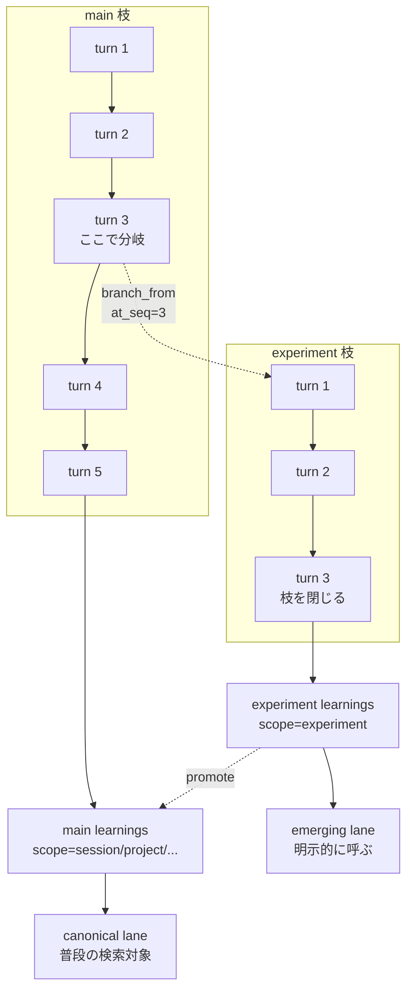

ポイントは 4 つです。

1. **分岐は session_id を新規採番**。親の `seq` 位置を `branched_at_seq` で記録するだけ。
2. **実験枝の learning は `scope='experiment'`** で同じテーブルに入る。普段の検索からは見えない。
3. **conflict と gap を捨てない**。learnings 同士の矛盾は別テーブルで関係付け、未解決事項は session_gaps として保存。
4. **claim_type で learning を分類**。observation / interpretation / signal / norm の 4 種で、Retriever が用途ごとに引ける。

---

## 2. ブランチの 4 状態

```mermaid
stateDiagram-v2
    [*] --> open_main: ingest 新規セッション
    [*] --> open_experiment: ingest --branch-from <parent> --at-seq <n>
    open_main --> open_main: 追記 ingest
    open_experiment --> open_experiment: 追記 ingest
    open_experiment --> closed_experiment: branch close <session_id>
    open_main --> closed_main: branch close <session_id><br/>(まれ; 完結したプロジェクト)
    closed_experiment --> promoted: promote (Stage C)
    closed_experiment --> [*]: そのまま eternal archive
    promoted --> [*]
    closed_main --> [*]
```

| state | `branch_kind` | learning の `scope` のデフォルト | retrieval から見えるか |
|------|--------------|-------------------------------|---------------------|
| `open_main` | `main` | `session` / `project` / `group` / `shared` | **はい** (canonical lane) |
| `open_experiment` | `experiment` | `experiment` | いいえ (emerging に明示問い合わせ時のみ) |
| `closed_experiment` | `experiment` | `experiment` + `archived_at` セット | いいえ (history 問い合わせのみ) |
| `promoted` | `experiment` | 親の scope に書き換え + `archived_at` で実験枝側はクローズ | はい (canonical) |
| `closed_main` | `main` | 各 learning は active のまま | はい (canonical) |

**重要**: closed は learning を物理削除しません。`archived_at` を立てるだけ。「過去にこういう実験があった」を retriever 側で `--include archived` で呼び戻せます。

---

## 3. データモデル — 追加と再定義

### 3.1 新旧 ER 比較

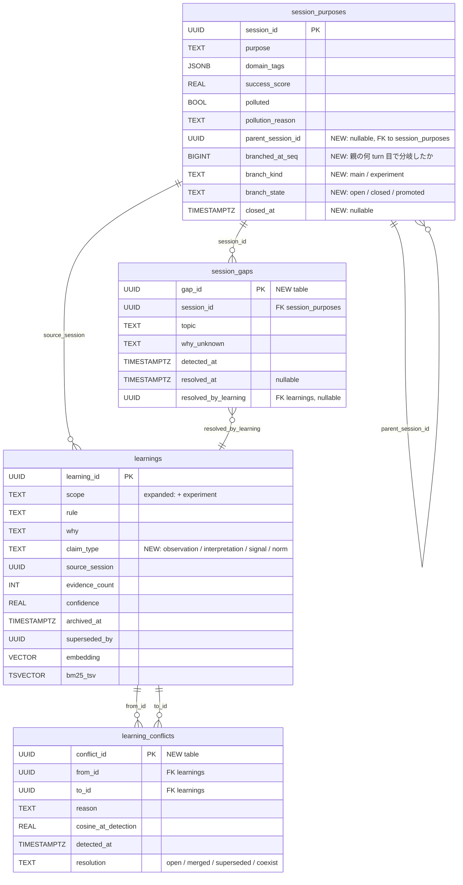

### 3.2 既存スキーマへの影響

| 項目 | 影響 | 対処 |
|------|------|------|
| `session_purposes` 既存行 | 全 NULL 列 + `branch_kind='main'`, `branch_state='open'` | migration の `op.execute("UPDATE ...")` で埋める |
| `learnings.scope` enum | `'experiment'` を追加 | Postgres は CHECK 制約で実装、ALTER で値追加 |
| `learnings.claim_type` | nullable で追加。**既存は NULL** | retriever は `claim_type IS NULL` を `signal` 扱いで後方互換 |
| 既存のユニットテスト | `parent_session_id` 等を default factory で吸収 | dataclass の default で NULL を許す |
| 既存の `search_hybrid` | scope filter に `experiment` を含めない | デフォルト除外を SQL に書く (3 章後半参照) |

### 3.3 Learning dataclass の変化

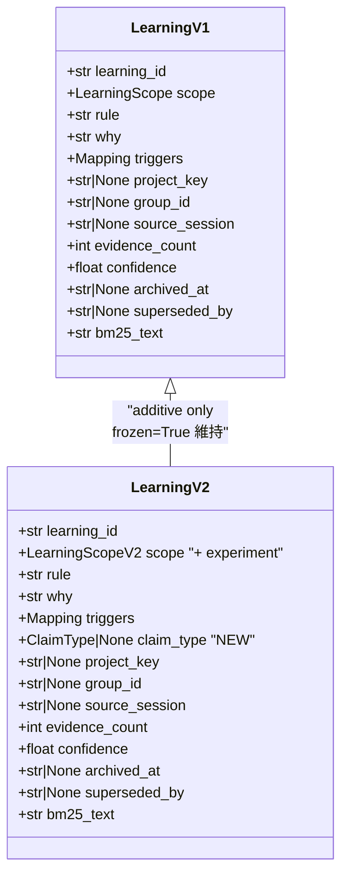

`@dataclass(frozen=True, slots=True)` を維持しつつ、新フィールドは default 付きで追加 → 既存呼び出しコードを壊さない。

---

## 4. claim_type — 4 種で learning を分類

記事 [zenn 8a2193df98ac05] の「typed artifact」の発想を取り込みます。同じ「learning」と呼んでいるものでも、実は 4 種類が混在していて、retriever や ContextPacker が用途ごとに使い分けたい、という話です。

### 4.1 4 種の定義

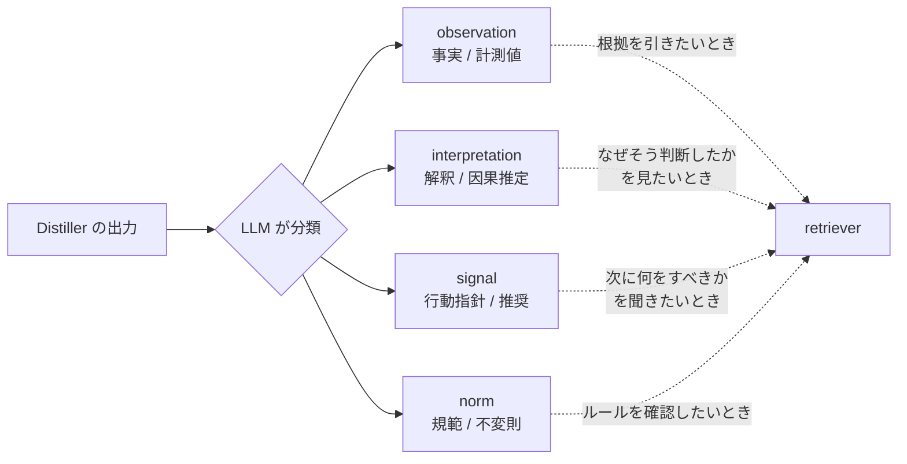

| claim_type | 意味 | 例 |
|------------|------|-----|
| `observation` | 観測した事実、計測値、再現性のあるシグナル | 「pgvector 0.5 の HNSW 構築は ef_construction=64 で 2 分」 |
| `interpretation` | 観測の解釈、因果の推定、仮説 | 「これは index 構築が CPU bound だからだろう」 |
| `signal` | 行動指針、推奨、次に試すべきこと | 「並列度を上げる前にメモリ余裕を確認すべき」 |
| `norm` | 規範、プロジェクトの不変則、合意事項 | 「learning は archived ではなく supersede で残す」 |

### 4.2 retriever の使い分け

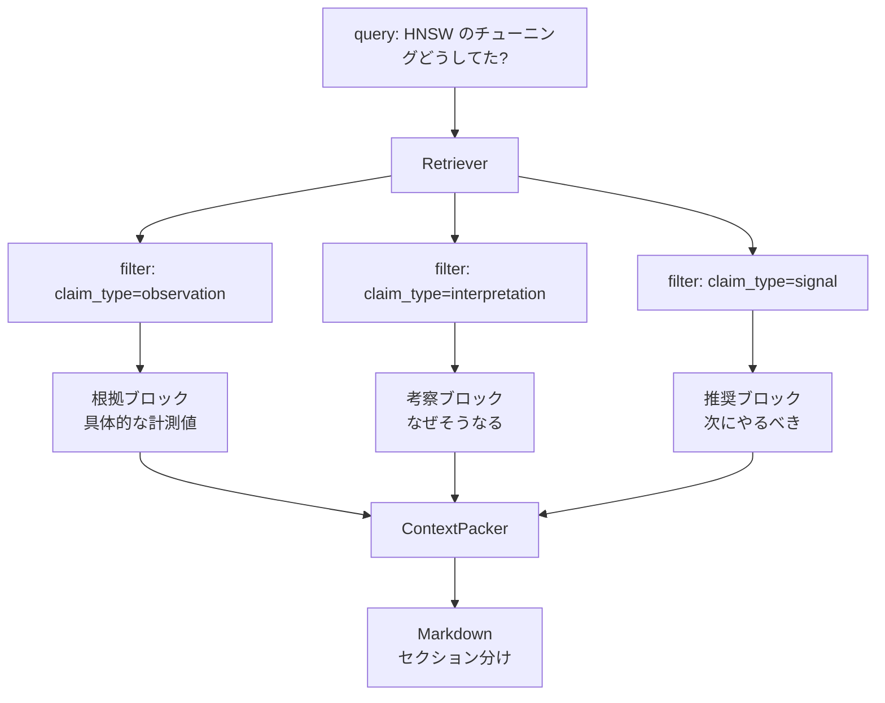

ContextPacker (Stage C) は claim_type ごとに Markdown のセクションを分けて返します。

```markdown
## Observed evidence
- [...]
- [...]

## Interpretations
- [...]

## Recommended signals
- [...]

## Norms (project-wide rules)
- [...]
```

LLM がこれを読んで「事実」と「解釈」を**自分で重み付けできる**点が記事の趣旨と一致します。

### 4.3 prompt 改修の最小差分

`src/stratoclave_distill/pipeline/distiller.py` の `_SYSTEM_PROMPT` の learnings 出力スキーマに `claim_type` を必須フィールドで追加:

```json
"learnings": [
  {
    "scope": "session",
    "rule": "...",
    "why": "...",
    "claim_type": "observation",   // ← 追加
    "triggers": {"...": "..."},
    "evidence_count": 1,
    "confidence": 0.7,
    "bm25_text": "..."
  }
]
```

LLM が判断できないときは `claim_type=null` を許容し、Distiller 側で `signal` にフォールバック (後方互換)。

### 4.4 後方互換の保証

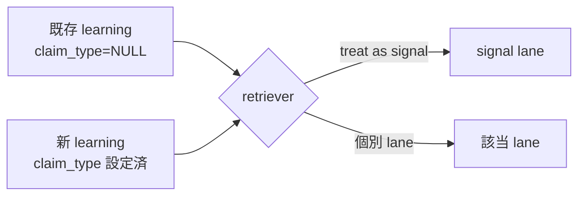

migration 0002 は既存行を**埋め直さない** (LLM 再呼び出しコストを発生させない)。retriever 側で NULL は signal にフォールバックして、新規セッションから順次 claim_type が積まれるイメージです。

---

## 5. Conflict と Gap — 捨てない設計

記事の最も鋭い指摘:

> 矛盾を含む evidence の平均化、context の陳腐化に対する lag、conflict と gap の消失

今の Curator は **SUPERSEDE で conflict を解決してしまっている**ので、ここを直します。

### 5.1 Curator の判定 — 4 アクションへ拡張

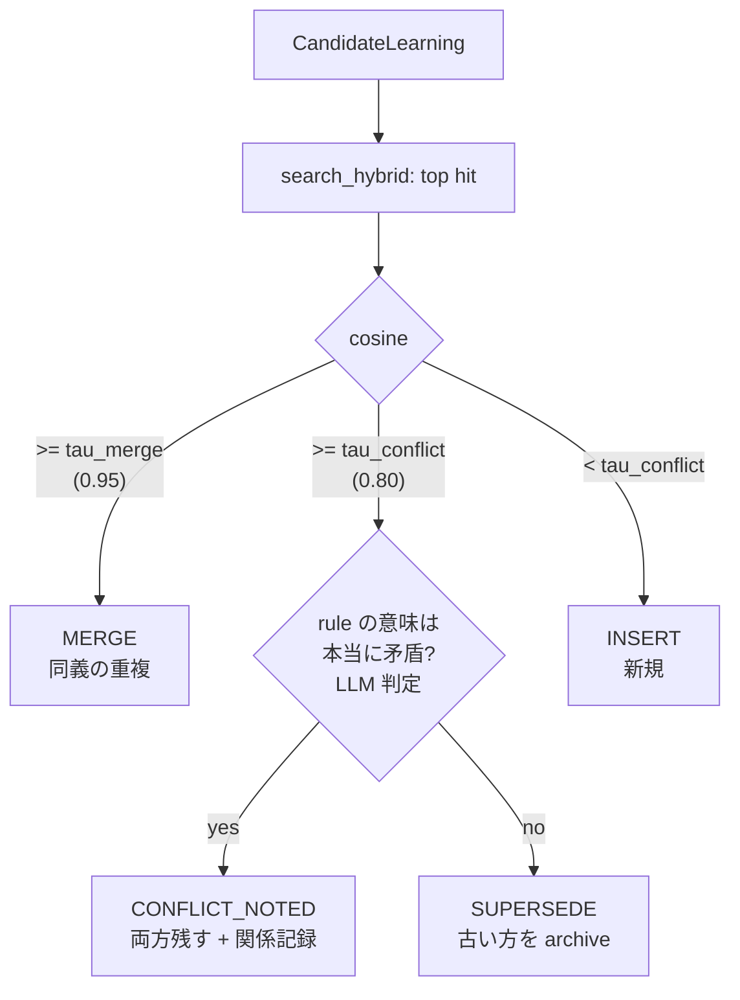

| アクション | 意味 | learnings テーブル | learning_conflicts テーブル |
|----------|------|-------------------|---------------------------|
| `INSERT` | 完全に新しい知見 | 新規行追加 | 何もしない |
| `MERGE` | 既存とほぼ同義 | 既存行を `update_rule`、`evidence_count++` | 何もしない |
| `CONFLICT_NOTED` | 似ているが**結論が違う** | 新規行追加 (両方生かす) | `(from=既存, to=新規, resolution='open')` |
| `SUPERSEDE` | 新版が古版を**置き換える** | 既存を `archived_at` + `superseded_by` | `(from=古, to=新, resolution='superseded')` |

`tau_conflict` の意味が変わります:
- **旧**: 「これより上は SUPERSEDE する閾値」
- **新**: 「これより上は **conflict 候補** とみなす閾値」(その上で LLM に矛盾判定を投げる)

### 5.2 矛盾判定の LLM コール

cosine 閾値だけで「矛盾しているかどうか」は判定できないので、Curator が second LLM call を出します:

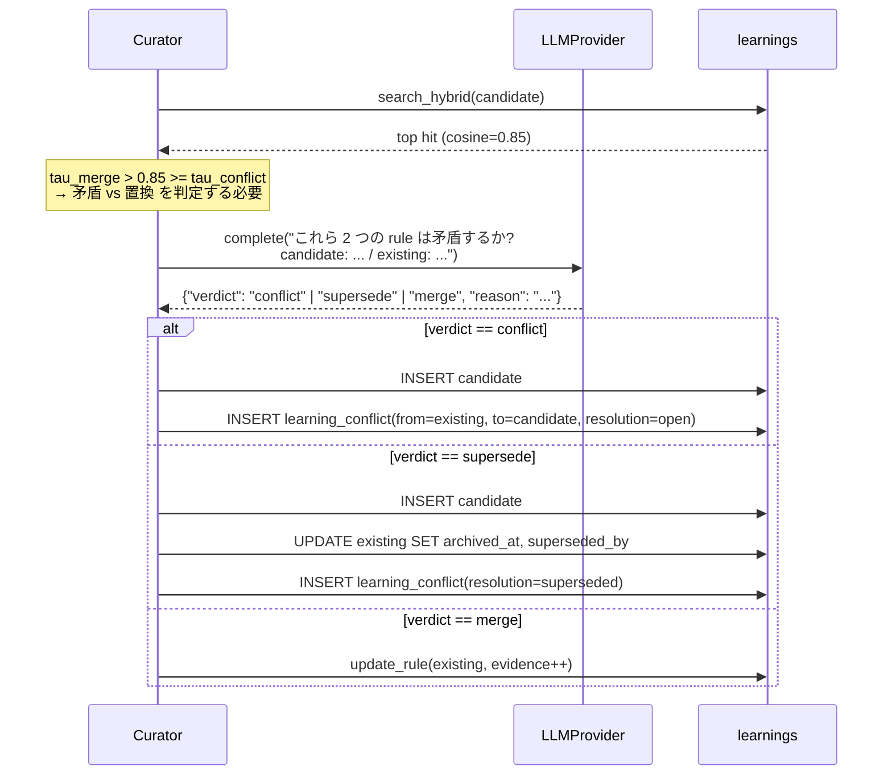

LLM コールが増えますが、cosine が `tau_merge` 以上なら判定スキップ (確実な merge)、`tau_conflict` 未満ならスキップ (確実な insert)。**境界帯のときだけ second call が走る**ので、平均的なコスト増は数パーセント程度の見込み。

### 5.3 Gap — 「分からなかったこと」を保存

prompt の JSON envelope に gaps フィールドを追加:

```json
{
  "purpose": {...},
  "digest":  {...},
  "learnings": [...],
  "gaps": [
    {"topic": "ef_search の最適値", "why_unknown": "本番データでの recall を測れていない"},
    {"topic": "並列構築の上限", "why_unknown": "メモリ制約でテストできず"}
  ]
}
```

これらは `session_gaps` テーブルに保存。Stage C の retriever で「過去にこの topic で gap があったか?」「その gap を解決した learning はあるか?」を引けます。

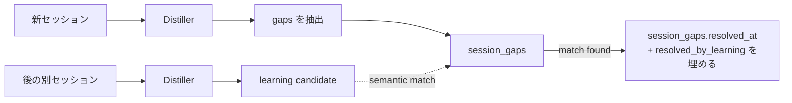

「過去のセッションで未解決だった gap が、今のセッションの learning で解消された」という連鎖を**自動的に検出**できる。これが Stage C の `query --include-resolved-gaps` のソース。

### 5.4 conflict のライフサイクル

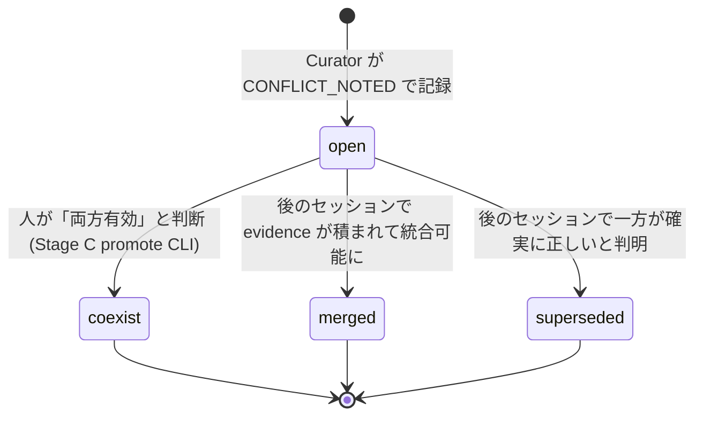

Stage C の `promote` / `gc` CLI が conflict を見て resolve していきます。Stage B+ の段階では `resolution='open'` で記録するだけ。

---

## 6. Retrieval lanes — canonical / emerging

記事の最重要主張のひとつ: **「retrieval を 2 lane に分離せよ」**。今の `search_hybrid` は 1 つのプールから返しますが、これを 2 系統に分けます。

### 6.1 lane の定義

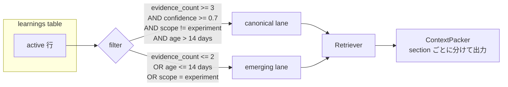

| lane | 条件 | 意味 |
|------|------|------|
| `canonical` | 複数セッションで再発見され、十分な時間 stable | 「これはもう確立した知見」 |
| `emerging` | 最近、または少数セッションだけ、または実験枝 | 「ドリフト中の signal、まだ揺れている」 |

**default**: retriever は **両方を取って ContextPacker でラベル付け**。LLM はラベルを見て自分で重み付け。記事で言う "structured uncertainty" の物理表現。

### 6.2 SQL での実装

`AsyncpgLearningStore.search_hybrid` の CTE に `lane` 列を追加するだけ:

```sql
WITH active AS (
    SELECT learning_id, embedding, bm25_tsv, bm25_text, scope,
           evidence_count, confidence, created_at,
           CASE
             WHEN scope = 'experiment' THEN 'emerging'
             WHEN evidence_count <= 2 THEN 'emerging'
             WHEN created_at > now() - interval '14 days' THEN 'emerging'
             ELSE 'canonical'
           END AS lane
    FROM learnings
    WHERE archived_at IS NULL
),
-- 以下、既存の vec / bm / fused CTE をそのまま
...
SELECT l.*, f.cosine, f.vrank, f.brank, f.rrf, a.lane
FROM fused f
JOIN learnings l USING (learning_id)
JOIN active a USING (learning_id)
ORDER BY f.rrf DESC
LIMIT ...;
```

`LearningSearchHit` に `lane: Literal['canonical', 'emerging']` を追加して返すだけ。**14 日**や**evidence_count=2** といった閾値は `DistillerConfig.lane_*` で env 管理。ハードコード禁止ルールを守ります。

### 6.3 ContextPacker (Stage C) の出力

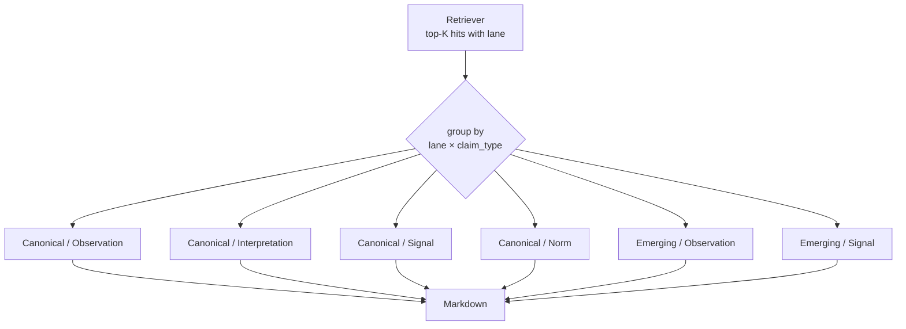

```markdown
## Canonical knowledge (stable)

### Observed
- ...

### Interpretations
- ...

### Recommended signals
- ...

### Norms
- ...

## Emerging signals (drifting / experimental)

### Observed (recent)
- ...

### Recommended signals (uncertain)
- ...

## Open conflicts
- learning A vs learning B (cosine=0.83): ...

## Unresolved gaps
- topic: "ef_search の最適値" — まだ未解決
```

LLM は「Canonical は信頼、Emerging は参考、Conflicts は両論、Gaps は要調査」を**ラベルから自分で判断**。

### 6.4 ブランチとの関係

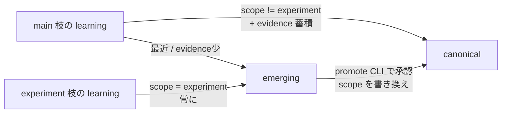

**Q1 のブランチと Q2 の lane は同じ軸の表現**。実験枝で生まれた learning は最初から emerging、promote されると canonical 候補になり、evidence が積まれると本物の canonical になる。

---

## 7. CLI surface — 何が増えるか

### 7.1 コマンド全体図

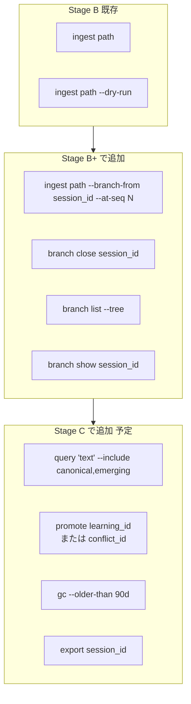

### 7.2 ingest --branch-from の動作

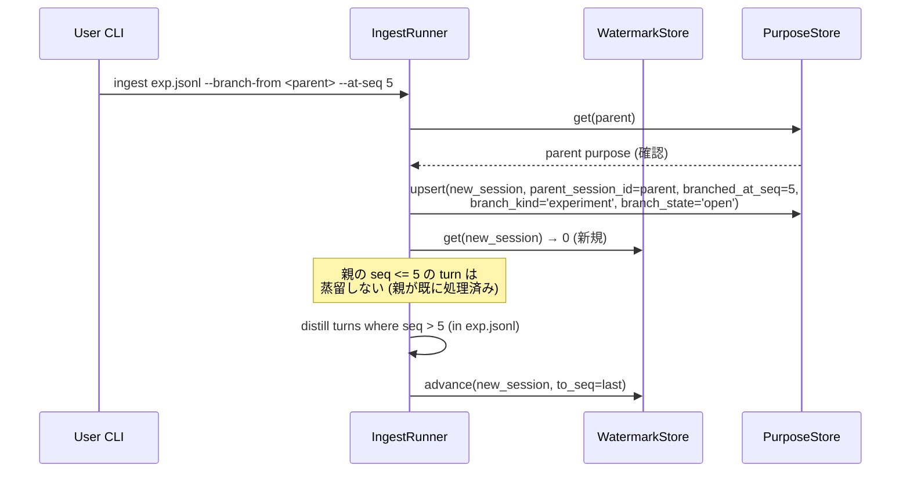

実験用 JSONL は **親の seq=6 から始まる前提**で書き出すか、Reader 側で `--at-seq 5` 以下を skip するオプションを足す (どちらでも実装可能、後者のほうが loom adapter 側に余計な責務を負わせない)。

### 7.3 branch close の動作

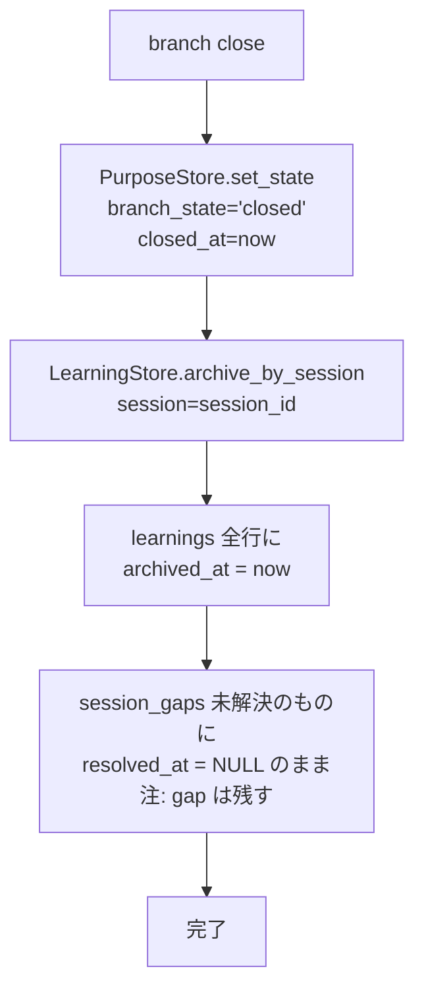

物理削除しません。**全行 `archived_at` セット**で論理クローズ。retriever のデフォルトから消えます。Stage C で `query --include archived` すれば呼び戻せます。

### 7.4 branch list --tree の出力

```
$ stratoclave-distill branch list --tree

main
  ├─ session 8a3f... [open]   "HNSW チューニング検証"
  │   └─ exp 2c1d... [closed] "ef_construction=128 試行"
  │   └─ exp 9e44... [open]   "並列構築検証中"
  └─ session 1f7b... [closed] "alembic migration 検証"

statistics:
  9 open, 4 closed, 2 promoted
  total learnings: 87 (62 canonical, 25 emerging)
  open conflicts: 3
  unresolved gaps: 5
```

JSON 形式 (`--json`) も並列で出す。Atelier の UI がこれを食べてツリー表示する想定 (Section 8 参照)。

### 7.5 promote (Stage C で実装) の概要

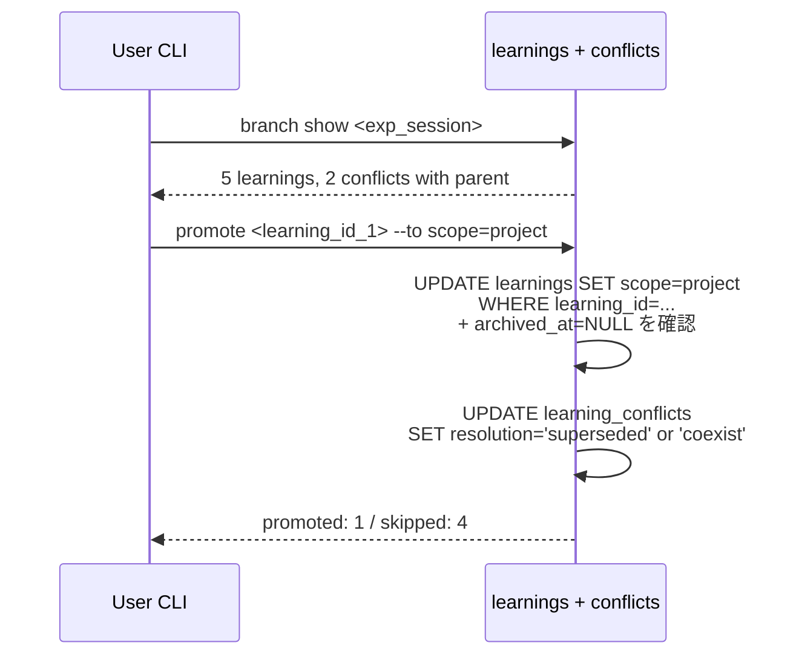

Stage C で実装。Stage B+ の段階では migration とデータ構造だけ用意して、CLI は `branch close` までで止めます。

---

## 8. ツリー可視化 — 責務分離 + raw turn の置き場所

ユーザーの期待:

> ノードをクリックすればその時までの会話を再現することができそう

会話再現には **raw turn (各 turn の full text) がどこかに永続化されている**必要があります。ここで重要な認識訂正:

> **loom は ACP エージェントのラッパーで、保管はしない。** loom は agent から流れてくるイベントを JSONL として吐き出すだけで、再読み出し API も DB も持たない。

なので「JSONL を loom に取りに行く」は誤りでした。raw turn の真の置き場所は以下のいずれかになります:

### 8.1 raw turn の置き場所 — 4 つの選択肢

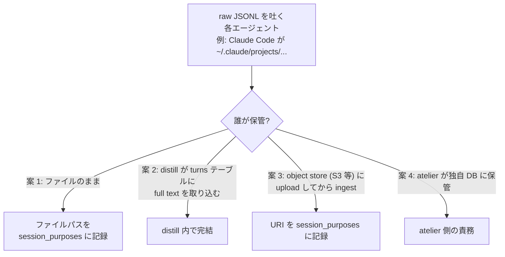

| 案 | distill のスキーマ変更 | 会話再現コスト | 移植性 / 永続性 | 責務の自然さ |
|----|---|---|---|---|
| 1. **ファイルパス記録** | `session_purposes.raw_jsonl_path TEXT` 1 列追加 | UI が path を read | ローカル限定。ファイル消えたら終わり | distill は薄く、責務逸脱なし |
| 2. **turns テーブル** | 新規 `session_turns` テーブル + index | DB 1 query で取れる | 一元管理、永続性高い | distill が "保管者" の責務を持つ |
| 3. **object store URI** | `session_purposes.raw_jsonl_uri TEXT` 1 列追加 | UI が S3 から read (署名 URL) | チーム共有可能、永続性高い | distill は metadata のみ、自然 |
| 4. **atelier 自前** | distill 何もしない | UI 側で全部 | atelier が DB を持つ必要 | distill 最小、UI が重くなる |

### 8.2 私の推し: 案 2 (distill 内 turns テーブル)、ただし **任意機能** にする

理由:
- ingest 時に `NormalizedTurn.raw_line` を **既に持っている** (現状はテーブルに永続化していないだけ)
- 会話再現が **DB 1 query** で完結 → atelier が薄くなる
- 検索インデックスは不要、`(session_id, seq)` の B-tree のみ → ストレージコストは低い
- 「JSONL を取り込んだ後に元ファイルが消えても会話再現できる」という保証が立つ
- **opt-in にする**: `DISTILL_RETAIN_TURNS=true` の env で有効化、デフォルト false。raw 保存したくないユースケース (個人情報配慮など) を尊重

### 8.3 案 2 のスキーマ追加

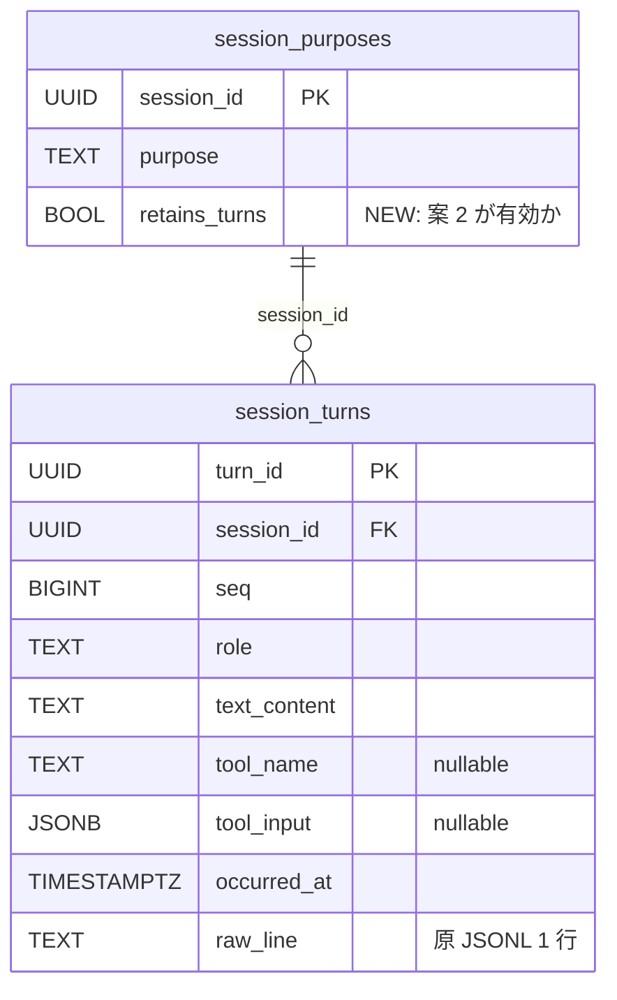

`(session_id, seq)` UNIQUE index と B-tree index。ingest 時に `DISTILL_RETAIN_TURNS=true` なら turns に書き込み、false なら何もしない (現状動作)。

### 8.4 責務の境界 — 訂正版

```mermaid
flowchart LR
    subgraph AG[各エージェント (Claude Code, Kiro, ...)]
        AG1[~/.claude/projects/...<br/>~/.kiro/sessions/...]
    end
    subgraph LM[loom (薄いラッパー)]
        LM1[ACP プロトコル仲介]
        LM2[adapter で JSONL 形式統一]
    end
    subgraph DS[distill (このリポ)]
        DS1[ingest: JSONL → 蒸留 + raw 保存 (opt-in)]
        DS2[branch list / show 等の検索 + メタ提供]
    end
    subgraph AT[atelier (将来)]
        AT1[ツリー UI]
        AT2[ノードクリック → 会話再現]
        AT3[新規枝作成 ボタン]
    end
    AG1 --> LM2
    LM2 --> DS1
    DS --> AT
    AT2 -.session_turns を query.-> DS2
    AT3 -.distill ingest --branch-from を呼ぶ.-> DS1
```

**訂正点**: loom は AG の出力を変換するだけで保管しない。raw の置き場所は (案 2 を採るなら) distill の `session_turns`。Atelier はそこに query を投げる。

### 8.5 ノードクリック → 会話再現 (案 2 採用版)

```mermaid
sequenceDiagram
    participant UI as Atelier UI
    participant D as distill (CLI / API)
    participant DB as Postgres

    UI->>D: branch show <session_id>
    D->>DB: session_purposes + session_turns COUNT
    D-->>UI: {parent_session_id, branched_at_seq, retains_turns: true, ...}
    UI->>D: turns get <session_id> --range 1..23 (親) + <session> --range 24..31
    D->>DB: SELECT * FROM session_turns WHERE session_id IN (...) AND seq BETWEEN ...
    DB-->>D: 31 turns
    D-->>UI: turns[]
    UI->>UI: 結合して会話を描画
```

**`retains_turns=false` の場合**: UI は「raw が保存されていません」を表示し、digest と learnings から要約だけ見せる。これなら案 2 を有効にしていなくても UX が壊れない。

### 8.6 新しい枝を UI から作るフロー (訂正版)

```mermaid
sequenceDiagram
    participant UI as Atelier UI
    participant CC as Agent (Claude Code 等)
    participant LM as loom (ラッパー)
    participant D as distill CLI

    UI->>UI: ノード <parent> の seq=23 で右クリック<br/>→ 「ここから新しい枝」
    UI->>CC: 新しい session を起動 (親 context を seed)
    CC->>LM: ACP イベントを流す
    LM->>LM: JSONL に変換してファイル出力
    UI->>D: ingest <new_jsonl> --branch-from <parent> --at-seq 23
    D-->>UI: IngestReport (新 session_id)
    UI->>UI: ツリー再描画
```

loom はここでも保管しない。**JSONL ファイル → distill ingest** の片道のみ。距 ingest 完了後、ファイルは捨てても (案 2 が有効なら) DB に残る。

### 8.7 案 2 を採るときの追加スコープ

migration 0002 か別 migration かは選択肢:

| アプローチ | メリット | デメリット |
|----------|---------|---------|
| 0002 にまとめる | 1 PR で完結 | スコープが膨らむ (ブランチ + claim_type + conflict + gap + turns) |
| 0003 として分離 | Stage B+ コアを薄く保てる | 2 回 migrate |

私の推し: **0003 に分離**。Stage B+ の核は「ブランチ + 構造化 learning」で、turns 保存は orthogonal (会話再現 UX のための機能)。Stage C 着手前に 0002 を入れて、UI 着手のタイミングで 0003 を追加するのがクリーン。

---

## 9. Migration 0002 — 何を変えるか

### 9.1 変更サマリ

```mermaid
flowchart LR
    M0[migration 0001<br/>5 tables] --> M2[migration 0002<br/>+ 2 tables<br/>+ 5 columns<br/>+ scope enum 拡張]
    M2 --> Final[7 tables: session_purposes, session_digests,<br/>learnings, distill_watermarks, group_learnings,<br/>learning_conflicts (NEW), session_gaps (NEW)]
```

### 9.2 SQL の骨子 (alembic upgrade)

```sql
-- session_purposes に分岐情報
ALTER TABLE session_purposes
  ADD COLUMN parent_session_id UUID NULL REFERENCES session_purposes(session_id),
  ADD COLUMN branched_at_seq BIGINT NULL,
  ADD COLUMN branch_kind TEXT NOT NULL DEFAULT 'main'
    CHECK (branch_kind IN ('main', 'experiment')),
  ADD COLUMN branch_state TEXT NOT NULL DEFAULT 'open'
    CHECK (branch_state IN ('open', 'closed', 'promoted')),
  ADD COLUMN closed_at TIMESTAMPTZ NULL;

-- learnings に claim_type と scope 拡張
ALTER TABLE learnings
  ADD COLUMN claim_type TEXT NULL
    CHECK (claim_type IN ('observation', 'interpretation', 'signal', 'norm') OR claim_type IS NULL);

-- scope の CHECK 制約を更新 (Postgres は CHECK の置き換えは DROP→ADD)
ALTER TABLE learnings DROP CONSTRAINT IF EXISTS learnings_scope_check;
ALTER TABLE learnings ADD CONSTRAINT learnings_scope_check
  CHECK (scope IN ('session', 'project', 'group', 'shared', 'experiment'));

-- 新テーブル: learning_conflicts
CREATE TABLE learning_conflicts (
    conflict_id UUID PRIMARY KEY DEFAULT gen_random_uuid(),
    from_id UUID NOT NULL REFERENCES learnings(learning_id) ON DELETE CASCADE,
    to_id   UUID NOT NULL REFERENCES learnings(learning_id) ON DELETE CASCADE,
    reason TEXT NOT NULL,
    cosine_at_detection REAL NOT NULL,
    detected_at TIMESTAMPTZ NOT NULL DEFAULT now(),
    resolution TEXT NOT NULL DEFAULT 'open'
      CHECK (resolution IN ('open', 'merged', 'superseded', 'coexist'))
);
CREATE INDEX learning_conflicts_from_idx ON learning_conflicts(from_id);
CREATE INDEX learning_conflicts_to_idx   ON learning_conflicts(to_id);
CREATE INDEX learning_conflicts_unresolved
  ON learning_conflicts(detected_at) WHERE resolution = 'open';

-- 新テーブル: session_gaps
CREATE TABLE session_gaps (
    gap_id UUID PRIMARY KEY DEFAULT gen_random_uuid(),
    session_id UUID NOT NULL REFERENCES session_purposes(session_id) ON DELETE CASCADE,
    topic TEXT NOT NULL,
    why_unknown TEXT NOT NULL,
    bm25_text TEXT NOT NULL DEFAULT '',
    bm25_tsv TSVECTOR GENERATED ALWAYS AS (to_tsvector('simple', bm25_text)) STORED,
    detected_at TIMESTAMPTZ NOT NULL DEFAULT now(),
    resolved_at TIMESTAMPTZ NULL,
    resolved_by_learning UUID NULL REFERENCES learnings(learning_id)
);
CREATE INDEX session_gaps_session_idx ON session_gaps(session_id);
CREATE INDEX session_gaps_unresolved
  ON session_gaps(detected_at) WHERE resolved_at IS NULL;
CREATE INDEX session_gaps_bm25_idx ON session_gaps USING GIN(bm25_tsv);
```

### 9.3 downgrade

PROJECT_RULES に従い、必ず `downgrade()` を書きます:

```sql
DROP TABLE session_gaps;
DROP TABLE learning_conflicts;
ALTER TABLE learnings DROP COLUMN claim_type;
ALTER TABLE learnings DROP CONSTRAINT learnings_scope_check;
ALTER TABLE learnings ADD CONSTRAINT learnings_scope_check
  CHECK (scope IN ('session', 'project', 'group', 'shared'));
-- branch_state='promoted' な行があると壊れるので事前に main/closed に戻す
UPDATE session_purposes SET branch_state='open' WHERE branch_state='promoted';
ALTER TABLE session_purposes
  DROP COLUMN closed_at,
  DROP COLUMN branch_state,
  DROP COLUMN branch_kind,
  DROP COLUMN branched_at_seq,
  DROP COLUMN parent_session_id;
```

`scope='experiment'` な行は downgrade で違反になるので、downgrade の事前 check で `RAISE EXCEPTION` するか、事前に手動 cleanup を要求するかは migration 内コメントで明記。

---

## 10. テスト計画 — 何を検証するか

```mermaid
flowchart LR
    subgraph U[Unit (in-memory)]
        U1[InMemory: branch_from が watermark を親から複製]
        U2[InMemory: scope=experiment は default search から除外]
        U3[Curator: CONFLICT_NOTED 判定 (LLM stub)]
        U4[Distiller: claim_type 抽出と NULL fallback]
        U5[gap detection と resolved_by_learning 紐付け]
        U6[branch close で全 learning が archived]
    end
    subgraph I[Integration (asyncpg + pgvector)]
        I1[migration 0002 round-trip]
        I2[再帰 CTE で branch list]
        I3[lane 列が canonical/emerging で正しく分類]
        I4[learning_conflicts CASCADE 削除]
        I5[session_gaps の resolve flow]
    end
    U -.no DB.-> P1[unit run]
    I -.gated by env.-> P2[integration run]
```

カバレッジ目標は維持 (line + branch 90%+)。新規コードは最初から TDD で書く。

### 10.1 注目すべき edge case

| ケース | 期待挙動 |
|------|----------|
| 親 session が存在しない `--branch-from` | `IngestError("parent session not found")` |
| `--at-seq` が親の watermark を超えている | warning を出して continue (将来の seq から枝が始まる前提) |
| `branch close` 中の同時 ingest | watermark の monotonic advance で防御、close は `branch_state='open'` の行にだけ作用 |
| 親が closed になっているところに新しい枝を作る | 許可するが warning ("parent is already closed") |
| circular parent (A→B→A) | CHECK 制約 + migration の defensive trigger で防止 |

---

## 11. ロールアウト戦略

```mermaid
flowchart TB
    P0[現在: Stage B 完了] --> P1[Step 1<br/>migration 0002 + dataclass + Protocol 拡張]
    P1 --> P2[Step 2<br/>Distiller の prompt に claim_type と gaps 追加]
    P2 --> P3[Step 3<br/>Curator に CONFLICT_NOTED アクション]
    P3 --> P4[Step 4<br/>IngestRunner に branch_from 経路]
    P4 --> P5[Step 5<br/>CLI: ingest --branch-from / branch list / branch close]
    P5 --> P6[Step 6<br/>Asyncpg 統合テスト + 後方互換テスト]
    P6 --> P7[完了: Stage B+ done<br/>→ Stage C 着手]
```

**段階分割の意図**: 各ステップで unit + integration が green になることを確認しながら進められるよう、依存をリニアに並べてあります。Step 1 は migration とデータ型だけなので**他の動作を一切変えません** (mypy が新フィールドを認識するだけ)。Step 2 以降で順に挙動が変わります。

### 11.1 並行作業の可能性

- Step 2 (prompt 改修) と Step 4 (branch_from) は **独立して進められる**
- Step 3 (CONFLICT_NOTED) は Step 2 の prompt 改修に依存しないが、claim_type が入っていたほうが矛盾判定の prompt が書きやすい
- Step 5 (CLI) は最後にまとめて

### 11.2 後方互換チェックリスト

- [ ] 既存の `Learning(...)` 呼び出しが新フィールドの default で動く
- [ ] 既存の `search_hybrid(query_text, query_vector)` が lane 引数なしで動く (default は両方を返す)
- [ ] 既存の JSONL を再 ingest しても新規エラーが出ない (claim_type=NULL で受け入れる)
- [ ] migration を up→down→up しても既存データが壊れない (前述の experiment scope 注意)

---

## 12. 不変の核 と 変わりうる部分 — 変更容易性の境界

このプロジェクトは **エージェント領域の概念がまだ揺れている時期**に書かれています。記事 [zenn 8a2193df98ac05] のアプローチも 1 つの仮説で、完全解ではありません。`claim_type` の 4 値が正しい切り口かも分かりません。canonical / emerging の 2 lane の閾値も運用してみないと分かりません。

そこで **何を変えない約束で、何が変わりうるか** を明示しておき、変わる時のコストを最小化する建付けにします。**過度な抽象化は避けます** — Protocol を増やしたり ABC を作ったりはしません。代わりに「この値は CHECK 制約で集合拡張」「この閾値は env で動く」「この副次関係は別テーブルで分離する」という具体的な仕分けで変更容易性を担保します。

### 12.1 3 層モデル

```mermaid
flowchart TB
    subgraph C[不変の核 Stable core]
        C1[Session 概念<br/>session_id + seq + role + text]
        C2[Branch 概念<br/>parent_session_id + branched_at_seq]
        C3[Watermark による incremental ingest]
        C4[永続化 Protocol<br/>Watermark/Purpose/Digest/Learning Store]
        C5[Provider Protocol<br/>LLMProvider/EmbeddingProvider]
        C6[公開 dataclass の不変性<br/>frozen=True + slots=True]
        C7[スコープ境界<br/>raw 取り込み + 蒸留 + 検索のみ]
    end
    subgraph E[慎重に変える層 Evolving]
        E1[claim_type の値集合]
        E2[scope の値集合]
        E3[branch_kind/state の値集合]
        E4[conflict.resolution の値集合]
        E5[Distiller JSON envelope のフィールド]
        E6[副次関係テーブル<br/>conflicts/gaps/supports/...]
    end
    subgraph T[気軽に変える層 Tunable]
        T1[tau_merge / tau_conflict]
        T2[lane 閾値<br/>min_evidence / min_age]
        T3[HNSW パラメータ]
        T4[RRF k 定数]
        T5[token budget]
        T6[Provider model / endpoint]
    end
    C -.|migration & major version<br/>でしか変えない| E
    E -.|alembic migration<br/>+ CHECK 拡張| T
    T -.|env 更新のみ<br/>コード変更なし| T
```

外側ほど「気軽に変えてよい」、内側ほど「変える時は major version 級の議論」。境界の引き方の意図:
- **核を太く取りすぎない**。例えば「`Learning` 公開型のフィールド構成」を核にすると変えづらいので、**フィールドは慎重層**にして「dataclass の不変性 (frozen=True)」だけ核にする
- **慎重層を CHECK 制約と副次テーブルで吸収する**。コアテーブルの列を増やすのは慎重層の中でも重い作業なので、できるだけ「副次関係は新テーブル」のルールにする
- **可変層は env で完結する**。新しい閾値を追加するときは `DistillerConfig` に env キーを足し、`src/` にハードコードしない

### 12.2 不変の核 (Stable core) — 変えない約束

| 何 | どこで担保 | 変える時の影響 |
|----|----------|------------|
| `session_id` UUID + `seq` 単調増加 + `role` + `text_content` | `core.types.NormalizedTurn` | 全パイプライン書き直し。Major version |
| 親子関係を `parent_session_id` + `branched_at_seq` で有向木として表す | `session_purposes` 列 | DAG 化したいなら別テーブル追加で対応 (今は木) |
| watermark による incremental ingest | `WatermarkStore` Protocol | 同上 |
| 永続化を Protocol で抽象化 (in-memory / asyncpg 同じ契約) | `db.stores` Protocol | 抽象を壊すと両実装書き直し |
| Provider を Protocol で抽象化 (LLM / Embedding) | `providers` Protocol | 同上 |
| 公開 dataclass の不変性 (`frozen=True`, `slots=True`) | PROJECT_RULES | mutation を許すと並列処理破綻 |
| distill のスコープ境界: **raw 取り込み + 蒸留 + 検索のみ**。エージェント実行しない。UI を持たない | DESIGN.md Section 1 | UI を抱えると loom/atelier との責務が崩壊 |

これらは「ここを変える話が出たら必ず major version の議論にする」という暗黙の約束です。

### 12.3 慎重に変える層 (Evolving) — migration が要るが変わる前提

```mermaid
flowchart LR
    A[新しい値 / 概念が要る] --> B{種類}
    B -- "既存列の値集合を増やす" --> M1[CHECK 制約を ALTER<br/>+ alembic migration]
    B -- "新しい関係を表現したい" --> M2[副次テーブル新設<br/>+ alembic migration]
    B -- "Distiller 出力を増やしたい" --> M3[prompt envelope に追加<br/>+ store API 追加]
    M1 --> R[後方互換テスト追加]
    M2 --> R
    M3 --> R
```

| 何 | 例 | 変更手段 |
|----|-----|---------|
| `claim_type` の値集合 | 今 4 種、将来 `question` / `decision` 追加 | CHECK 拡張 + retriever のフォールバック確認 |
| `scope` の値集合 | 今 5 種、将来 `team` / `org` 追加 | CHECK 拡張 + search_hybrid のデフォルト除外見直し |
| `branch_kind` / `branch_state` の値集合 | 今 `main`/`experiment` × `open`/`closed`/`promoted`、将来 `merged_back` 等 | CHECK 拡張 + 状態遷移ルール更新 |
| `learning_conflicts.resolution` の値集合 | 今 `open`/`merged`/`superseded`/`coexist`、将来 `superseded_by_evidence` 等 | CHECK 拡張 |
| Distiller の JSON envelope | 今 `purpose`/`digest`/`learnings`/`gaps`、将来 `decisions` / `open_questions` 追加 | prompt 改修 + 新 store 追加 |
| 副次関係テーブル | 今 `learning_conflicts` / `session_gaps`、将来 `learning_supports` / `learning_depends_on` | 新テーブル追加 (コアテーブル列追加は **しない**) |

**ルール**:
1. **CHECK 制約 + migration で行う**。enum 型は使わない (Postgres enum は ALTER が手間)
2. **既存行を default で吸収**。NULL 許容で追加し、過去データを LLM 再蒸留で埋め直さない
3. **後方互換テストを必ず追加**。古いデータが新コードで読めるか integration test に入れる
4. **副次関係はコアテーブル拡張ではなく新テーブル**。learnings に列を増やすより learning_X テーブルを足すほうを好む

### 12.4 気軽に変える層 (Tunable) — env で吸収

| 何 | env キー (例) | デフォルト |
|----|------|---|
| cosine merge 閾値 | `DISTILL_TAU_MERGE` | `0.95` |
| cosine conflict 閾値 | `DISTILL_TAU_CONFLICT` | `0.80` |
| canonical lane 最小 evidence | `DISTILL_LANE_CANONICAL_MIN_EVIDENCE` | `3` |
| canonical lane 最小 age (日) | `DISTILL_LANE_CANONICAL_MIN_AGE_DAYS` | `14` |
| HNSW build / search パラメータ | `DISTILL_HNSW_*` | 既存値 |
| RRF k 定数 | `DISTILL_RRF_K` | `60` |
| token budget | `DISTILL_CONTEXT_BUDGET_DEFAULT` | `2000` |
| Provider 種別 / model / endpoint | `DISTILL_LLM_*` / `DISTILL_EMBEDDING_*` | 既存値 |
| `session_turns` 永続化 (案 2) | `DISTILL_RETAIN_TURNS` | `false` |

**ルール**:
1. すべて `DistillerConfig.from_env()` 経由
2. `src/` にハードコード禁止 (PROJECT_RULES no-hardcode)
3. テスト時の override は `DistillerConfig(...)` の kwarg で行う

### 12.5 拡張ポイント — 「将来こうなりうる」を織り込む

実装は今やらないが、データ構造はぶつからないことを確認しておきたい未来:

| 拡張 | 慎重層 / 可変層のどこで吸収 | 影響範囲 |
|------|-----|--------|
| claim_type に `question` 追加 | 12.3 CHECK 拡張 | retriever の section 分けに 1 種追加 |
| `learning_supports` (refutes でなく "補強") | 12.3 副次テーブル | retriever が "補強される signal" を引ける |
| Aggregator が group_learnings を生成 | 既存テーブル (group_learnings) 利用、新規 Protocol 追加 | Stage C 後半の話 |
| 別 Provider (Bedrock / Cohere) | 12.4 + Provider Protocol 実装追加 | LLM/Embedding を切り替えるだけ |
| 多言語 BM25 (今 simple のみ) | 12.4 + tsvector 設定追加 | migration が要る (重い変更) |
| ベクトル次元の動的変更 | **慎重層を超える**。core の議論 | 別 DB / re-embed が必要 |

最後の項目だけ核 (12.2) に近い。次元変更は仕様変更に等しく、「同じスキーマで両次元同居」はできないことを織り込んでおきます。

### 12.6 zenn 記事との関係 — 記事は 1 つの仮説

記事 [zenn 8a2193df98ac05] が示した枠組みを我々が採用したのは、**現時点で具体性が一番高かったから**であって、これが正解と判断したからではありません。具体的に:

- typed artifact の具体型を `observation/interpretation/signal/norm` の 4 種にしたのは **我々の解釈**。記事は型を分けよと言っているが値集合は提示していない
- canonical / emerging の 2 lane は記事の "retrieval 分離" の我々なりの実装
- conflict を捨てない、gap を残す、は記事の主張に対する我々の具体化

これらは全部 **慎重層 (12.3)** に置かれています。記事のフレームが進化したり、別フレーム (例: グラフベースの knowledge graph 風) に置き換わったりした時、慎重層だけ書き換えれば**核は壊れない**建付けにしてあります。

> **言い換えると**: 「lane が 2 つで足りない」「claim_type が 6 種要る」「conflict ではなく provenance の方が大事」と分かった時、migration 1 本 + retriever の section 分け変更で対応できます。Session 概念や Branch 概念は触らずに済みます。

### 12.7 変更時のチェックリスト

新しい変更要求が来た時、まずどの層に当たるか判断:

```mermaid
flowchart TB
    Q[変更したいこと] --> A{何を変える?}
    A -- "閾値 / モデル / endpoint" --> T[12.4 Tunable<br/>env 更新だけ]
    A -- "既存列の値を 1 個増やす" --> E1[12.3 Evolving<br/>CHECK 拡張 migration]
    A -- "新しい関係概念を入れる" --> E2[12.3 Evolving<br/>副次テーブル新設 migration]
    A -- "Distiller の出力種類を増やす" --> E3[12.3 Evolving<br/>prompt + store + retriever]
    A -- "Session / Branch / Watermark の意味を変える" --> C[12.2 Stable core<br/>Major version 議論]
    A -- "Protocol の契約を変える" --> C
```

|層|変更コスト|テスト追加|migration|
|---|---|---|---|
|12.4 Tunable|env 更新のみ|なし|なし|
|12.3 Evolving|migration + コード追加|後方互換テスト必須|あり|
|12.2 Stable|major version + 全テスト書き直し|全層|複数本|

---

## 13. Q&A

### Q1. なぜ実験枝を別テーブルにしないの?

スキーマの倍化と検索コードの分岐コストが大きすぎるからです。`scope='experiment'` の 1 値追加で同じ機能が出せ、既存の `search_hybrid(scope=...)` がそのまま使えます。**プールは 1 つ、フィルタで分ける** が distill の設計思想に合っています。

### Q2. CONFLICT_NOTED の LLM コール、コスト気にならない?

cosine が `tau_merge` 以上 (例: 0.95) なら判定スキップ、`tau_conflict` 未満ならスキップ。**境界帯 (0.80 〜 0.95) のときだけ走る**ので、既存ベンチマーク値で見ると全体の数 % 程度の learnings に対してしか発生しません。むしろ「矛盾を検出できなかった」コストのほうが長期的には大きいので、入れる価値があると判断します。

### Q3. lane の閾値 (14 days, evidence 2) はどこから?

仮の値です。`DistillerConfig.lane_canonical_min_evidence` / `lane_canonical_min_age_days` で env 管理。運用しながら調整。`docs/DESIGN.md` Section 7 のテーブルに追加する想定。

### Q4. claim_type を LLM が間違えたら?

`claim_type=NULL` を許容して signal にフォールバックするので、**間違えても retrieval は動きます**。後から人が修正する CLI (`learning relabel <id> --claim-type observation`) を Stage C か後続で考えれば十分。

### Q5. ブランチが何段にも深くなったら?

再帰 CTE は深さ無制限ですが、UI 表示の都合で 5 段くらいで warning を出すのが現実的でしょう。distill 側はガードしません (制約は UI 側)。

### Q6. 既存の SUPERSEDE の意味が変わるけど移行は?

既存 SUPERSEDE 行はそのまま (resolution は推定不能なので NULL のまま)。新規分から `learning_conflicts` に記録される、という前向き互換。**過去に遡って conflict を検出することはしない** (LLM コストとデータ正確性のバランス)。

---

## 14. 参照ファイル

| 知りたいこと | 見るべきファイル |
|------|----|
| 元の設計 | `/Users/akazawt/stratoclave-distill/docs/DESIGN.md` |
| Stage B の全体像 | `/Users/akazawt/stratoclave-distill/docs/STAGE_B_WALKTHROUGH.md` |
| 既存 Learning dataclass | `/Users/akazawt/stratoclave-distill/src/stratoclave_distill/core/types.py` |
| 既存 store Protocol | `/Users/akazawt/stratoclave-distill/src/stratoclave_distill/db/stores.py` |
| 既存 Curator | `/Users/akazawt/stratoclave-distill/src/stratoclave_distill/pipeline/curator.py` |
| 既存 Distiller (prompt 改修対象) | `/Users/akazawt/stratoclave-distill/src/stratoclave_distill/pipeline/distiller.py` |
| 元 migration | `/Users/akazawt/stratoclave-distill/migrations/versions/0001_initial_schema.py` |
| 記事 (Q2 の出発点) | https://zenn.dev/mofuteq/articles/8a2193df98ac05 |

---

**Stage B+ はここまで。** 次は migration 0002 を起こすところから着手します。

