# Stage B 解説 — Ingest パイプラインを 1 ファイルで読み解く

**最終更新**: 2026-05-23
**対象**: stratoclave-distill v0.1 / Stage B（取り込みパイプライン）
**読者**: 「コードはまだ読めていないが、Stage B 全体で何が起きているのか理解したい人」

---

## 0. この文書の使い方

stratoclave-distill の Stage B は、**Claude Code のような AI エージェントの会話ログ（JSONL）を、検索しやすい形に「蒸留」して Postgres に貯める**仕組みです。

- 入力: 1 行 1 ターンの JSONL（`stratoclave-loom` の adapter が吐く形式）
- 出力: Postgres + pgvector 上の 4 種類の行（purpose / digest / learning / watermark）
- 中間で動くもの: LLM（要約）、Embedding API（ベクトル化）、ハイブリッド検索（重複検出）

この文書は、Stage B のコード（`src/stratoclave_distill/pipeline/` と `src/stratoclave_distill/db/`）を読まなくても全体像と「なぜそうなっているか」が掴めるように、**Mermaid 図を多用して**書いています。

---

## 1. 全体像 — 1 枚で

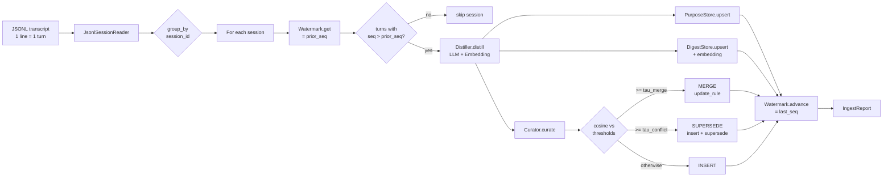

ポイントは 4 つです。

1. **入口は JSONL 1 本**。「セッション」という単位で論理グルーピングされます。
2. **watermark でインクリメンタル化**。同じ JSONL を 2 回流しても、新しいターンしか LLM に投げない。
3. **LLM が一度に 3 種類のものを抽出**: セッションの「目的」、要約（digest）、再利用したい教訓（learning）。
4. **教訓は重複検出（cosine + BM25）してから書き込む**。同じことを 100 回学ばせない仕組み。

---

## 2. 用語の整理

| 用語 | 何を指すか | データベース上のテーブル |
|------|-----------|--------------------------|
| **NormalizedTurn** | JSONL の 1 行を Python オブジェクトにしたもの | (DB には保存しない、中間表現) |
| **SessionPurpose** | 「このセッションは何をやっていたか」+ 健全性 | `session_purposes` |
| **SessionDigest** | セッション要約 (Markdown) + 検索用テキスト + ベクトル | `session_digests` |
| **Learning** | 再利用可能な教訓 1 件 (rule + why) | `learnings` |
| **Watermark** | セッションごとの「ここまで蒸留済み」の seq 値 | `distill_watermarks` |
| **Embedding** | テキストをベクトル化したもの (1024 次元など) | 各テーブルの `embedding` カラム |
| **BM25 text** | 全文検索用に正規化した平文 | 各テーブルの `bm25_text` カラム |

「役割」と「テーブル」の対応を見ると、**ストアが 4 種類**あることが分かります。それぞれを `Protocol` で抽象化してあるのが Stage B の設計の肝です（後述）。

---

## 3. データの形 — 入力 JSONL と DB の対応

### 入力 JSONL（NormalizedTurn）

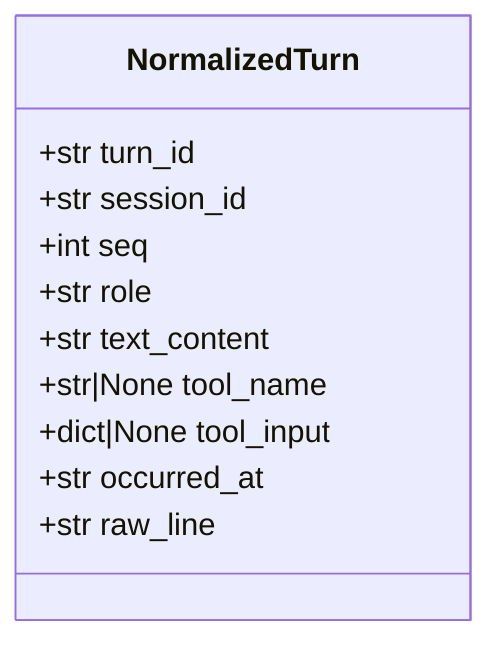

`seq` は **セッション内で単調増加する整数**で、watermark の比較に使います。`role` は `user` / `assistant` / `tool` などのラベル、`tool_name` と `tool_input` は AI エージェントがツールを呼んだときに埋まります。

### 出力テーブル（DB の 4 表）

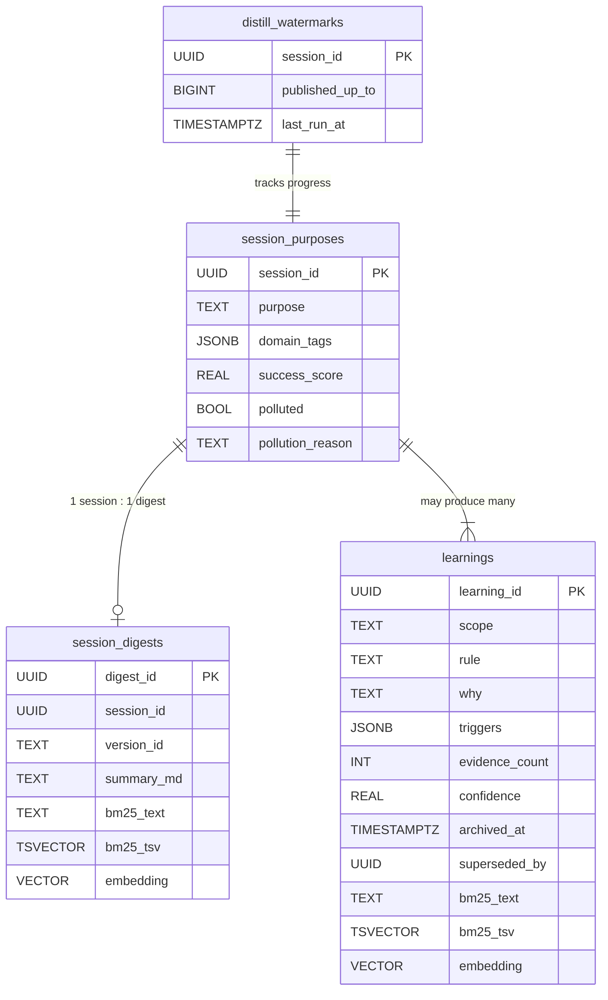

**注目点**:
- `bm25_tsv` は `bm25_text` から **STORED 生成カラム** で自動生成。書き込む側はテキストだけ気にすれば良い。
- `embedding` は pgvector の `vector` 型。次元数は `DISTILL_EMBEDDING_DIM` 環境変数で migration が決定する（Voyage は 1024、OpenAI text-embedding-3-small は 1536 など）。
- `learnings.archived_at` と `superseded_by` で、**過去の教訓を消さずに新版で上書き**できる仕組み。

---

## 4. 処理ステップを詳しく — 5 段階

### 4.1. ステップ 1: JsonlSessionReader（読み込み）

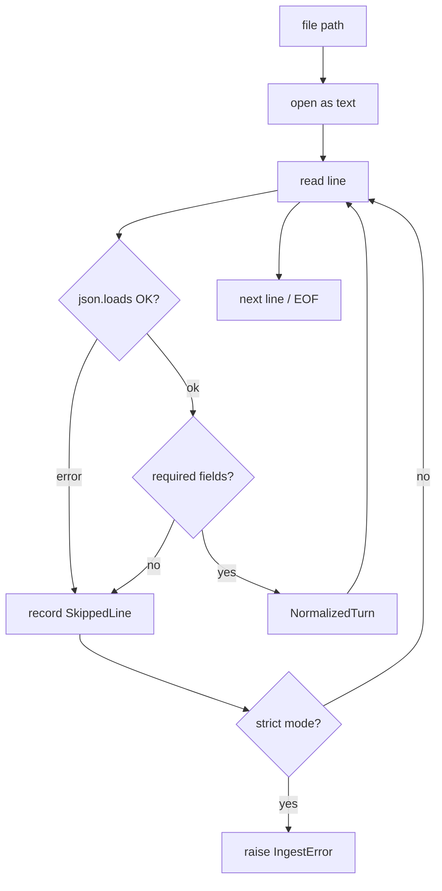

- **lenient モード**: 壊れた行を `SkippedLine(line_no, reason, raw)` として記録し、続行。CI のフィクスチャや手書きデータが多少汚れても止まらない。
- **strict モード**: 1 行目で異常があれば即 `IngestError`。本番取り込みでは strict を推奨。

`seq` フィールドが無い行に対しては、ファイル内の位置から自動採番されるので、`stratoclave-loom` の adapter が `seq` を埋めなかった場合でも壊れません。

### 4.2. ステップ 2: セッションごとにグルーピング

```mermaid
flowchart LR
    A[turns: NormalizedTurn[]] --> B[dict: session_id -> turns[]]
    B --> C1[session A: 4 turns]
    B --> C2[session B: 7 turns]
    B --> C3[session C: 1 turn]
```

JSONL の中で複数セッションが混在していても、`session_id` でグルーピングしてセッション単位に処理します。各セッションは独立して扱われ、**1 つのセッションが LLM 呼び出しに失敗しても他のセッションには波及しない**のが重要なポイントです（後述）。

### 4.3. ステップ 3: Watermark でインクリメンタル化

```mermaid
sequenceDiagram
    participant R as IngestRunner
    participant W as WatermarkStore
    participant T as turns

    R->>W: get(session_id)
    W-->>R: prior_seq = 5
    R->>T: filter seq &gt; 5
    Note over R,T: turns 6, 7, 8 だけ残る
    R->>R: distill (turns 6..8)
    R->>W: advance(session_id, to_seq=8, last_run_at=...)
```

- 同じ JSONL に行を追記して再実行しても、**新規分だけ LLM に投げる**。
- `advance` は `GREATEST(既存, 新値)` で **monotonic**。古い値で上書きされないことを SQL レベルで保証。
- 失敗時は `advance` を呼ばないので、リトライで自動的に「失敗した範囲をやり直す」セマンティクスになる。

### 4.4. ステップ 4: Distiller — LLM 1 回で 3 種類抽出

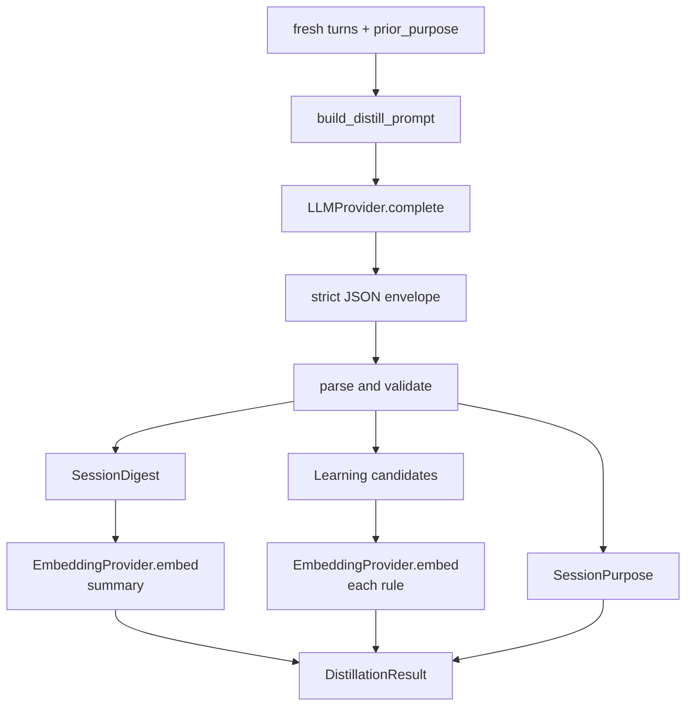

LLM へのリクエストは **1 セッションにつき 1 回**。プロンプトでは

```
{
  "purpose": { "purpose": ..., "domain_tags": [...], "success_score": ..., "polluted": ..., "pollution_reason": ... },
  "digest":  { "summary_md": ..., "bm25_text": ... },
  "learnings": [{ "scope": ..., "rule": ..., "why": ..., "triggers": {...}, "evidence_count": ..., "confidence": ..., "bm25_text": ... }, ...]
}
```

という **strict JSON エンベロープ**を要求します。プロンプト本文は `pipeline/distiller.py` の `_SYSTEM_PROMPT` に固定文字列として置いてあるので、モデルやバージョンを切り替えても挙動が再現します。

埋め込み生成は LLM とは別プロバイダ（Voyage / OpenAI / Stub）で、digest と各 learning のテキストを順番にベクトル化します。

### 4.5. ステップ 5: Curator — INSERT / MERGE / SUPERSEDE 判定

ここが Stage B で**最もユニークな部分**です。

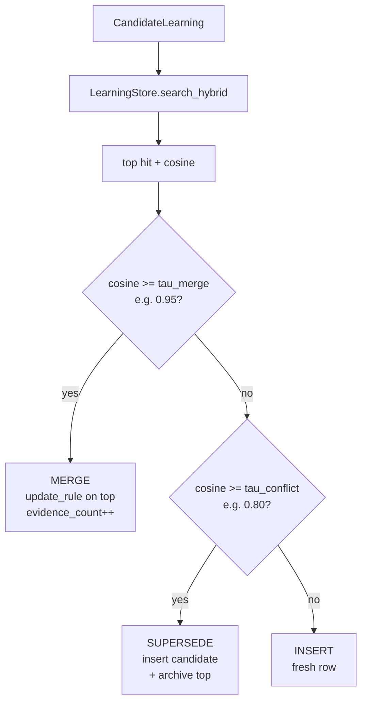

なぜこの 3 分岐かというと、AI エージェントの教訓は

- **ほぼ同じ知見が何度も発見される** → MERGE で `evidence_count` を積む（信頼度が上がる）
- **似ているが矛盾する** → SUPERSEDE（古い方を `archived_at` でマークし、新しい方を生かす）
- **完全に新しい知見** → INSERT

という 3 パターンに自然に分かれるからです。**閾値 `tau_merge` / `tau_conflict` は `DistillerConfig` から注入**されるので、運用しながらチューニングできます。

#### 重要な設計判断

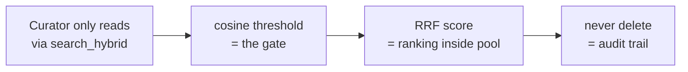

- **cosine が判定軸、RRF はランキング軸**。RRF（Reciprocal Rank Fusion）はベクトル類似度と BM25 の両方を融合してランキングするための補助で、最終判定は生の cosine で行います。これにより、テキストが完全一致でも意味が違うケース（cosine 低、BM25 高）に騙されません。
- **削除しない**。SUPERSEDE は古い行を消さず `archived_at` + `superseded_by` を埋めるだけ。`list_active` がアーカイブ行を除外するので普段は見えませんが、過去の知見は残ります。

---

## 5. ハイブリッド検索 — Curator の心臓部

`LearningStore.search_hybrid` は Curator が呼ぶ唯一の読み出し API です。In-memory 実装と asyncpg 実装で同じ Protocol を満たしますが、内部の処理は別物です。

### 5.1. In-memory 実装（テスト用）

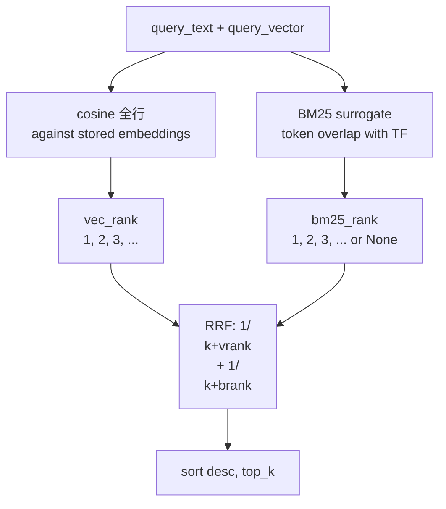

ピュア Python なので外部依存無しで動きます。`InMemoryLearningStore._bm25_lite` は本物の BM25 ではなく、トークン重複の TF 重み付けで似たランキングを生成する**サロゲート**です。テストの目的は「順序を間違えていないか」を検証することなので、これで十分です。

### 5.2. asyncpg 実装（本番）

`AsyncpgLearningStore.search_hybrid` は、**1 本の SQL** で同じことをやります。

```mermaid
flowchart LR
    subgraph SQL ["1 つの SQL（CTE）"]
        A[active CTE<br/>archived_at IS NULL] --> B[vec CTE<br/>1 - embedding &lt;=&gt; query]
        A --> C[bm CTE<br/>ts_rank_cd]
        B --> D[fused CTE<br/>1/&#40;k+vrank&#41; + 1/&#40;k+brank&#41;]
        C --> D
        D --> E[ORDER BY rrf<br/>LIMIT top_k]
    end
```

CTE で段階的に組み立てて、最後に `learnings` 本体と JOIN して結果を返します。

```sql
WITH active AS (
    SELECT learning_id, embedding, bm25_tsv, bm25_text
    FROM learnings
    WHERE archived_at IS NULL
),
vec AS (
    SELECT learning_id,
           1 - (embedding <=> $1) AS cosine,
           ROW_NUMBER() OVER (ORDER BY embedding <=> $1 ASC) AS vrank
    FROM active
),
bm AS (
    SELECT learning_id,
           ts_rank_cd(bm25_tsv, plainto_tsquery('simple', $2)) AS score,
           ROW_NUMBER() OVER (...) AS brank
    FROM active
    WHERE bm25_tsv @@ plainto_tsquery('simple', $2)
),
fused AS (
    SELECT v.learning_id, v.cosine, v.vrank, b.brank,
           (1.0 / ($3 + v.vrank)) + COALESCE(1.0 / ($3 + b.brank), 0.0) AS rrf
    FROM vec v LEFT JOIN bm b USING (learning_id)
)
SELECT l.*, f.cosine, f.vrank, f.brank, f.rrf
FROM fused f
JOIN learnings l USING (learning_id)
ORDER BY f.rrf DESC
LIMIT ...;
```

**ポイント**:
- `embedding <=> $1` は pgvector のコサイン距離演算子。`1 - 距離 = 類似度` を `cosine` として返す。
- `ROW_NUMBER() OVER (ORDER BY ... ASC)` で **順位を SQL 内で生成**。RRF は順位ベースの融合なので、生のスコアではなく順位を使う。
- BM25 側は `LEFT JOIN` なので、ベクトルマッチがあるが BM25 マッチが無い行も結果に残る。その場合 `bm25_rank` は `NULL` になり、RRF 寄与は `COALESCE(..., 0)` で 0 になる。
- HNSW + GIN インデックスが効くので、行数がスケールしても応答時間が悪化しにくい。

### 5.3. なぜ「2 つを混ぜる」のか

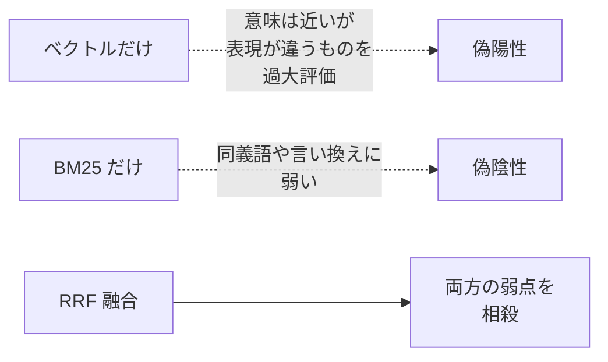

ベクトル検索は「意味」、BM25 は「文字列」を見ます。RRF は「両方で上位に来る」ものを優先するので、片方だけで嘘をつかれにくくなります。

---

## 6. エラー隔離 — 1 セッション失敗が他に波及しない

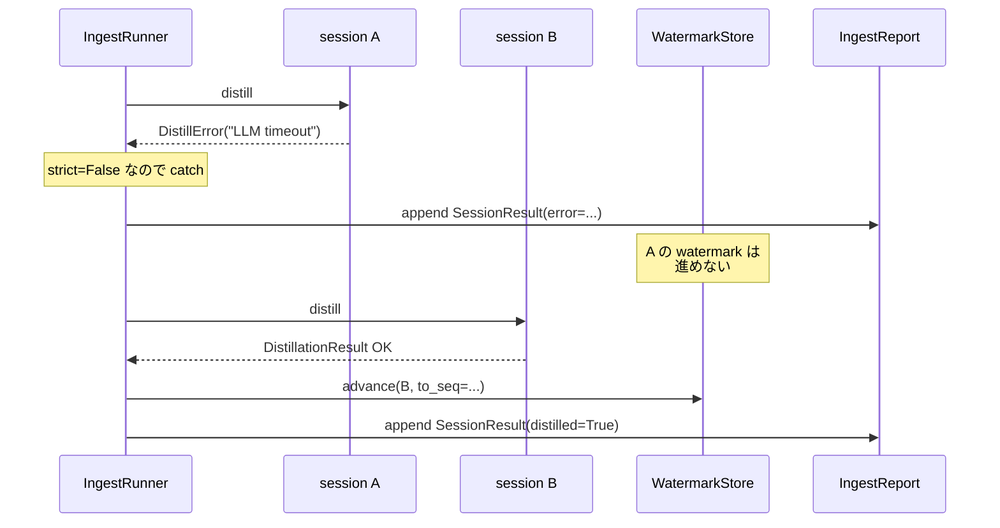

- `strict=False`（デフォルト）では、`DistillError` が出たセッションは `error` フィールドに理由を記録するだけで、次のセッションの処理は続行する。
- 失敗したセッションは watermark を進めないので、次回の ingest で**自動的にリトライされる**。
- `strict=True`（CLI の `--strict` フラグ）では、最初の失敗で例外が伝播。CI / 本番で「サイレント失敗を許容したくない」運用に使う。

---

## 7. ストアの抽象化 — Protocol で疎結合

Stage B の設計で一番恩恵が大きいのが、**永続化層を Protocol（duck typing）で切り離している**ことです。

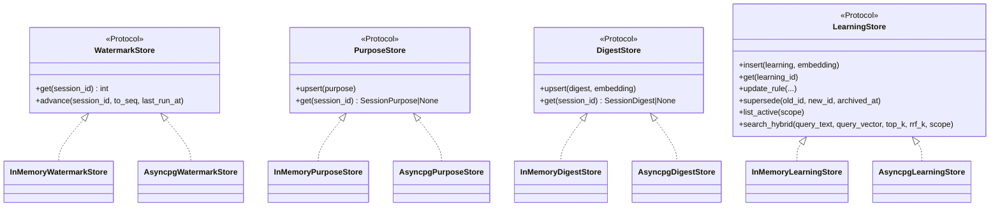

`IngestRunner` も `Curator` も「`Protocol` に書かれたメソッドが呼べる何か」しか要求しないので、

- **ユニットテスト**: `InMemory*` を渡す → DB なしで全パイプラインが動く（225 ユニットテスト全部これ）
- **本番**: `Asyncpg*` を渡す → 同じコードが Postgres + pgvector に書く
- **将来**: SQLite 版や Redis 版を追加するときも、Protocol を満たす実装を 1 個書くだけ

という三段構えが組めます。**「同じ契約に対する 2 種類の実装」が、in-memory 統合テストと asyncpg 統合テストを分離できる根拠**になっています。

---

## 8. CLI から見たフロー — `stratoclave-distill ingest`

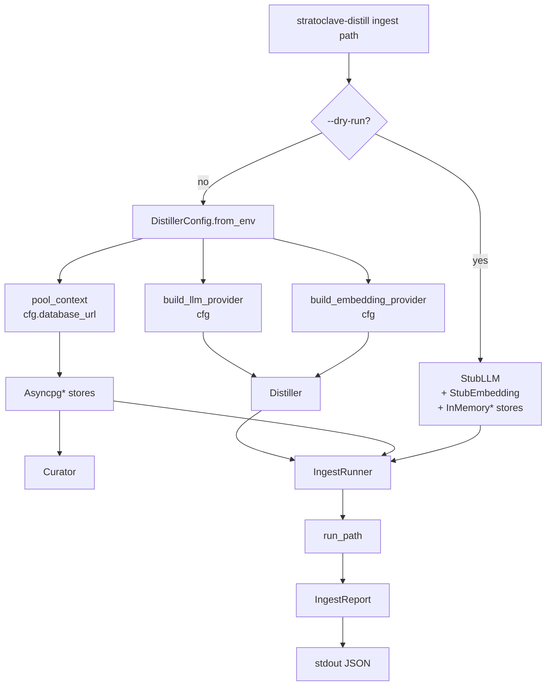

- **`--dry-run`** はテストとフィクスチャ検証用。DB も API キーも要らずに「JSONL がパイプラインを通せるか」だけ確認できる。
- **本番モード**は `DistillerConfig.from_env()` 経由で全設定を環境変数から読む。`embedding_provider.dimension` と `cfg.embedding_dim` が一致しないと起動時に `DistillError`（migration 時の次元と矛盾するのを早期に検出）。
- 出力は常に **JSON 1 オブジェクト**。`session_count` / `distilled_count` / `error_count` / 各セッションのアクション集計など。スクリプトでパースしやすい形を維持。

---

## 9. テストの構造

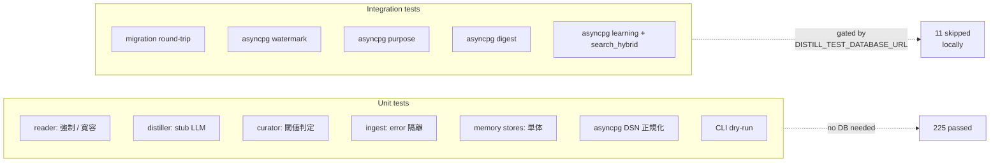

- **ユニットテスト**は `Stub*` プロバイダと `InMemory*` ストアのおかげで、**ネットワーク・DB・API キー不要**。CI でも数秒で完走する。
- **統合テスト**は `pytest -m integration` + `DISTILL_TEST_DATABASE_URL` で初めて実行される。`docker compose up -d` した Postgres + pgvector に対して、migration を走らせ、各ストアの契約を物理的に検証する。

---

## 10. ありがちな疑問 (Q&A)

### Q1. なぜ「LLM が一度に 3 種類抽出」する設計なのか？

複数回 LLM を叩くと**一貫性が崩れる**から。
たとえば「purpose は『デバッグ』なのに learnings には設計の話しか入っていない」みたいなズレを防ぐために、同じプロンプトで一気に出させて、その JSON 内の整合性は LLM 自身に取らせる。

### Q2. `tau_merge=0.95` / `tau_conflict=0.80` の数字はどこから？

`docs/DESIGN.md` の参考値で、運用しながら調整する想定。設定は `DistillerConfig` 経由なので、デプロイ時に環境変数で上書きできる（`DISTILL_TAU_MERGE` など）。

### Q3. ベクトル次元はどう決める？

migration が `DISTILL_EMBEDDING_DIM` 環境変数を読む。Voyage voyage-3 なら 1024、OpenAI text-embedding-3-small なら 1536。**migration を流したときの値と本番で使う embedding provider の dimension が一致していないと CLI が起動時に弾く**。

### Q4. JSONL の同じ行を 2 回読み込んだら？

watermark のおかげで、2 回目は新しい seq が無いため `distilled=False` でスキップされる。LLM 呼び出しは発生しない。

### Q5. 大量のセッションを並列処理できる？

Stage B は逐次実行。DB は asyncpg pool（`min_size=1, max_size=4`）で並列接続を許容しているが、`IngestRunner` 自体は **per-session 直列**。Stage C 以降で並列度を上げる余地あり（`DISTILL_WORKERS` で予約済み）。

### Q6. 「polluted」って何？

LLM が「このセッションは学ぶ価値が低い」「内容が破綻している」と判定したフラグ。検索時に除外する用途を想定。Distiller は不確かなときは `polluted=true` にして `pollution_reason` を埋めるよう指示されている。

---

## 11. 次へのつなぎ — Stage C の準備

Stage B で「貯める側」が完成したので、Stage C は「取り出す側」です。

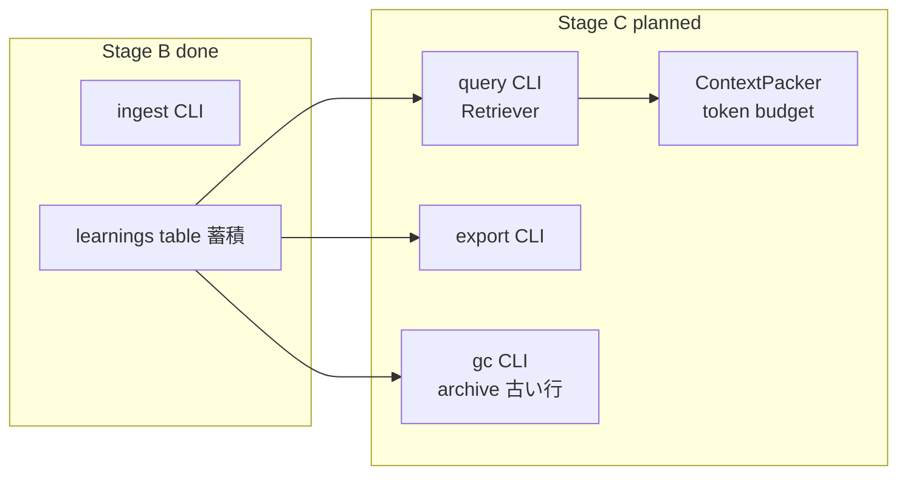

`search_hybrid` は既に実装済みなので、Stage C の `Retriever` はその上に薄く乗るだけ。`ContextPacker` がトークン予算内に収めて Markdown を返し、最終的に `stratoclave-loom` 経由で Claude / Kiro / 他のエージェントに注入する、というのが v0.1 の完成像です。

---

## 12. もっと深く読みたい人へ

| 知りたいこと | 見るべきファイル |
|--------------|------------------|
| データクラスの正確な形 | `src/stratoclave_distill/core/types.py` |
| 設定値の正規化と検証 | `src/stratoclave_distill/config.py` |
| プロンプトの本文 | `src/stratoclave_distill/pipeline/distiller.py` `_SYSTEM_PROMPT` |
| 閾値判定の実コード | `src/stratoclave_distill/pipeline/curator.py` `_curate_one` |
| RRF の SQL | `src/stratoclave_distill/db/asyncpg.py` `search_hybrid` |
| In-memory の RRF | `src/stratoclave_distill/db/memory.py` |
| エラー隔離 | `src/stratoclave_distill/pipeline/ingest.py` `_run_session` |
| migration | `migrations/versions/0001_initial_schema.py` |
| CLI の組み立て | `src/stratoclave_distill/cli.py` |
| テストの組み合わせ | `tests/unit/pipeline/test_ingest.py`, `tests/integration/test_asyncpg_stores.py` |

---

**Stage B はここまで。** 次の Stage C は「Stage B が貯めたものを、エージェントが使える形で取り出す」フェーズです。
