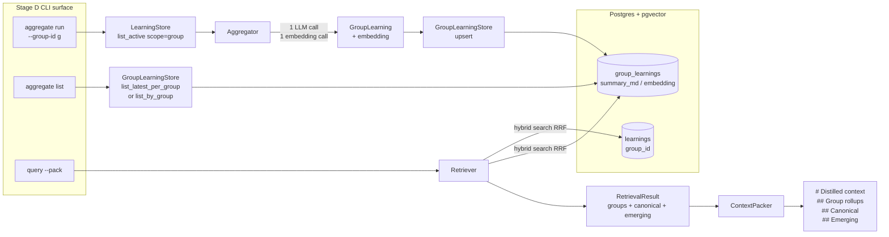
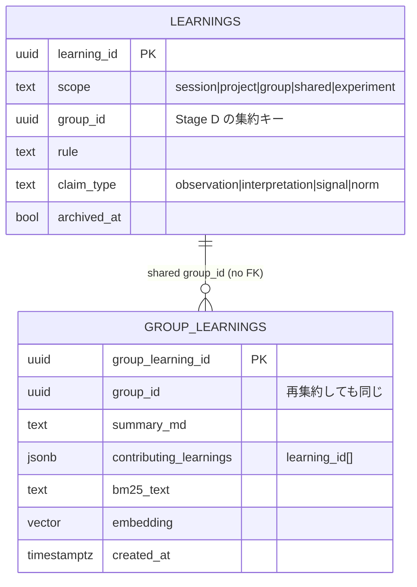

# Stage D 解説 — Aggregator と group rollup を 1 ファイルで読み解く

**最終更新**: 2026-05-25
**対象**: stratoclave-distill v0.1 / Stage D（Aggregator と group_learnings の retrieval 段）
**読者**: Stage A / B / B+ / C を読んだ上で、「個別の learning は引けるようになったが、似た学びをまとめた『rollup』はどう作って、どう retrieval に乗せるのか」を読み物として理解したい人

---

## 0. この文書の使い方

Stage C までで `learnings` テーブル（個別のルール）は canonical / emerging の 2 lane で hybrid search できるようになりました。
Stage D はその 1 段上に **「同じ `group_id` を持つ learning を 1 つの rollup に束ねる」** 段を載せます。

- 入力: Stage B+ までで `learnings` に積まれた `group_id` 付きの行群
- 出力: `group_learnings` 1 行（`summary_md` + 埋め込み + 監査用の `contributing_learnings`）と、それを `query --pack` の Markdown 先頭に流し込む経路
- 新しく増えたコード: `pipeline/aggregator.py`（新規）、`db/{stores,memory,asyncpg}.py` の `GroupLearningStore` 系統、`retrieval/{retriever,packer}.py` の group 段、`cli.py` の `aggregate` サブコマンド

この文書は `docs/STAGE_C_WALKTHROUGH.md` の続きとして読めるよう書いてあります。

---

## 1. Stage D の全体像 — 1 枚で



ポイントは 4 つです。

1. **Aggregator は永続化しない**。1 回の LLM 呼び出しと 1 回の埋め込み呼び出しで `AggregationResult(group_learning, embedding)` を返すだけ。永続化は CLI / オーケストレーション側で `GroupLearningStore.upsert(...)` を明示的に呼ぶ。
2. **再集約は "削除 + 上書き" ではなく "新しい行を追加"**。`group_learning_id` は毎回新規 UUID。古い rollup は残るので、いつ・何から rollup を作ったかの監査ログが残る。Retriever は `DISTINCT ON (group_id) ORDER BY group_id, created_at DESC` で最新だけ拾う。
3. **rollup は lane gating の対象外**。「同じグループの learning を集めたもの」自体が canonical 扱い。`Retriever.retrieve()` は groups を専用フィールドで返し、`ContextPacker` は Markdown の最上段に置く。
4. **`aggregate run --dry-run` は DB / LLM を一切触らない**。CLI が固定の fixture learning を 2 件生成して、deterministic な stub LLM 応答を流す。スモークテストや CI で安定して動かせる。

---

## 2. 用語の整理

| 用語 | 何を指すか | 由来 |
|------|-----------|------|
| **GroupLearning** | `group_learning_id`, `group_id`, `summary_md`, `contributing_learnings`, `bm25_text`, `created_at` を持つ frozen dataclass | Stage D 新規。embedding は dataclass の外（`upsert` の kwarg）で運ぶ |
| **AggregationResult** | `group_learning + embedding` のペア | Aggregator の戻り値。永続化は呼び出し側 |
| **GroupLearningStore** | `upsert / get / list_by_group / list_latest_per_group / search_hybrid` の Protocol | InMemory + asyncpg の 2 実装。LearningStore と同じ「Protocol → 二実装」パターン |
| **`group_learnings`** | migration `0001` で予約済みの table（`group_learning_id` PK / UUID `group_id` / pgvector 埋め込み / 生成 `bm25_tsv`） | Stage D で新規 migration は要らない |
| **`contributing_learnings`** | rollup を作る元になった `learning_id[]` を JSONB で保存 | 監査用。「この rollup は何を見て書かれたか」を後から確認できる |
| **`top_k_groups`** | Retriever のグループ段専用の RRF カット数。デフォルト 3 | per-row の `top_k` とは別ノブ |
| **dry-run aggregate** | DB に触らず stub LLM の deterministic レスポンスで `AggregationResult` を作って JSON で吐くだけ | smoke test / CI 用のショートカット |

---

## 3. データモデルの繋がり

`learnings` と `group_learnings` の関係は次のとおり。`group_learnings.group_id` は `learnings.group_id` を共有しますが FK ではありません（rollup は learning の集約結果なので、同じ `group_id` の learning が増減しても rollup 側は audit trail として残します）。



`contributing_learnings` は JSONB なので、後から `WHERE contributing_learnings @> '"L-xxx"'::jsonb` のような jsonb 演算子で「この learning がどの rollup に組み込まれたか」を逆引きできます。

---

## 4. Aggregator の API 契約

```python
class Aggregator:
    def __init__(
        self,
        llm: LLMProvider,
        embedder: EmbeddingProvider,
        *,
        max_tokens: int = 1024,
        temperature: float = 0.0,
        clock: Callable[[], str] = _utc_now,
    ) -> None: ...

    async def run(
        self,
        learnings: Sequence[Learning],
        *,
        group_id: str,
    ) -> AggregationResult: ...
```

3 つの不変条件を `run()` 内で守っています。

1. **`group_id` が空文字列なら `LLMError`**。
2. **`learnings` が空なら `LLMError`**（LLM に「何もない rollup を書いて」と頼まないため）。
3. **入力 learning の `group_id` が引数の `group_id` と一致しない場合は `LLMError`**（呼び出し側のフィルタミスを早期検出）。

LLM への契約は「JSON object 1 個を返せ」だけです。スキーマは:

```json
{
  "summary_md": "<Markdown 段落 1 つ + 箇条書き>",
  "bm25_text": "<同じ内容の plain text、検索用>"
}
```

`contributing_learnings` は LLM に再導出させません（呼び出し側で持っている権威情報なので、parse 後に dataclass に上書きします）。これで「LLM が新しいルールを発明してしまう」事故を構造的に潰しています。

---

## 5. ストア実装の対称性

`InMemoryGroupLearningStore` と `AsyncpgGroupLearningStore` は同じ Protocol を満たします。Stage B 以来の方針どおり、unit test は in-memory で本物のオーケストレータを通し、integration test だけ live Postgres を叩きます。

asyncpg 側の `search_hybrid` は 1 本の SQL CTE で完結します（per-row LearningStore とほぼ同じ形）。

```sql
WITH latest AS (
    SELECT DISTINCT ON (group_id) group_learning_id, group_id, embedding, bm25_tsv
    FROM group_learnings
    ORDER BY group_id, created_at DESC
),
vec AS (
    SELECT group_learning_id,
           1 - (embedding <=> $1) AS cosine,
           ROW_NUMBER() OVER (ORDER BY embedding <=> $1 ASC) AS vrank
    FROM latest
),
bm  AS (...),
fused AS (
    SELECT v.group_learning_id, v.cosine, v.vrank, b.brank,
           (1.0 / ($3 + v.vrank)) +
           COALESCE(1.0 / ($3 + b.brank), 0.0) AS rrf
    FROM vec v LEFT JOIN bm b USING (group_learning_id)
)
SELECT g.*, f.cosine, f.vrank, f.brank, f.rrf
FROM fused f JOIN group_learnings g USING (group_learning_id)
ORDER BY f.rrf DESC LIMIT $top_k
```

最初の `latest` CTE が「再集約の audit trail はテーブルに残しつつ retrieval は最新だけ」を実現する核です。

---

## 6. Retriever と ContextPacker の繋ぎ込み

`Retriever` のコンストラクタには `group_learning_store` がオプショナル引数として追加されました。指定があれば `retrieve()` の戻り値 `RetrievalResult.groups` に最大 `top_k_groups` 件 (デフォルト 3) の `GroupLearningSearchHit` を入れます。指定がなければ `groups = ()` で従来挙動を維持します。

`ContextPacker.pack()` は title / query エコー直後、lane ループの前に `_emit_groups()` を呼びます。Markdown は次の形：

```markdown
# Distilled context

_query_: <query_text>

## Group rollups

### Group rollup: <group_id> [<group_learning_id>]

<summary_md from the Aggregator>

### Group rollup: <次の group_id> [...]

...

## Canonical
...
```

各 rollup は heading + body を atomic に admit します（半端な状態で混入させない）。budget 不足で 1 つ目が入りきらなかった場合は section ごと丸ごとスキップして lane に budget を譲ります。

---

## 7. CLI: `aggregate run` と `aggregate list`

### `aggregate run --group-id <id>`

Production path:

1. `DistillerConfig.from_env()` で env を読む。
2. `pool_context(database_url)` で asyncpg pool を取得。
3. `AsyncpgLearningStore.list_active(scope=None)` で active な learning を全件読み、`group_id == --group-id` の行に絞り込む（CLI 側で filter）。
4. 0 件なら `rc=2`、1 件以上なら `Aggregator.run(...)` を呼んで `AsyncpgGroupLearningStore.upsert(...)` で永続化。
5. 結果を JSON で stdout に出力。

Dry-run path (`--dry-run`):

1. 固定 fixture (`L-dry-0`, `L-dry-1`) を `InMemoryLearningStore` に積む。
2. CLI 内蔵の `_dry_run_aggregate_responder()` が deterministic な JSON を返す stub LLM を組み立てる。
3. `Aggregator.run(...)` の戻り値だけを JSON で吐いて終了。DB / LLM 一切なし。

`--group-id ""` は CLI parser を通った後の validation で `rc=2` を返します（argparse は空文字列を許してしまうため）。

### `aggregate list [--group <id>]`

`--group` なし: `list_latest_per_group()` → 全 group_id ごとに最新 1 行ずつ、`created_at DESC`。

`--group <id>`: `list_by_group(<id>, latest_only=False)` → 指定 group_id の history を newest first で全部返す。「再集約のたびにどう変わったか」を確認する用途。

両方とも prod path のみ（`DATABASE_URL` 必須）です。

---

## 8. テスト面のサマリ

- **unit**: 14 group-learning store テスト + 12 Aggregator テスト + 5 retriever group-tier テスト + 4 packer group-section テスト + 3 CLI aggregate テスト。
- **integration** (`tests/integration/test_asyncpg_stores.py`): 6 件追加。round-trip / latest-per-group / history audit / hybrid search dedup-to-latest / 2-group ranking / Aggregator → AsyncpgGroupLearningStore upsert end-to-end。
- すべて in-memory（unit）/ live Postgres（integration）の両側で同じ Protocol を踏むので、二重実装が drift しないことを契約レベルで保証しています。

---

## 9. デザイン上の意思決定 (FAQ)

**Q. なぜ Aggregator は CLI 側でしか起動しないのか？**
A. 自動発火（ingest のたびに rollup を作り直す）にするとトークン消費が読めなくなるためです。Stage D は DESIGN.md の「P (LLM 再要約) + X (CLI explicit)」を採っています。再集約タイミングは運用側に明け渡す方針。

**Q. なぜ rollup を `learnings` に書き戻さない？**
A. retrieval 段で「同じ内容が canonical lane と group rollup の両方に出てきて重複する」のを避けるためです。rollup は別テーブル別 lane に分離し、ContextPacker が階層的に並べる責任を負います。

**Q. なぜ `contributing_learnings` を JSONB に？**
A. learning と rollup の関係は many-to-many ではなく 1 rollup → N learning の片方向参照で十分なため、専用のリレーションテーブルを切らず JSONB で持っています。逆引きは `@>` 演算子で十分高速です。

**Q. なぜ embedding を dataclass の外で運ぶのか？**
A. `GroupLearning` を JSON にシリアライズしたときに、巨大な float 配列が混じらないようにしています（`learnings` 側と同じ約束）。

---

## 10. 関連ドキュメント

- [`DESIGN.md`](./DESIGN.md) — 全体設計。Stage D は §4 v0.2 の Aggregator + §5.2 の ContextPack 構成に対応。
- [`STAGE_B_PLUS_DESIGN.md`](./STAGE_B_PLUS_DESIGN.md) — Stage B+ で `group_id` と claim_type を導入した経緯。
- [`STAGE_C_WALKTHROUGH.md`](./STAGE_C_WALKTHROUGH.md) — Retriever / ContextPacker / CLI 4 つの土台。
- [`PROJECT_STATUS.md`](./PROJECT_STATUS.md) — Stage D 完了時点のコンポーネント表とテストカバレッジ。
